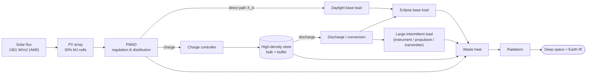
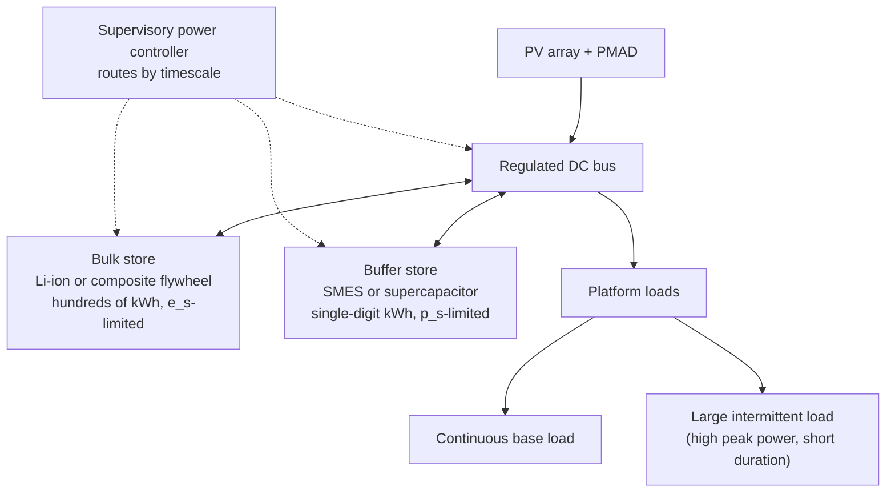
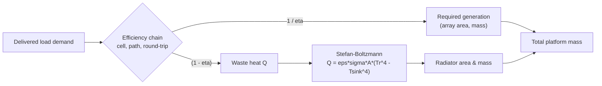

# Solar Generation and High-Density Energy Storage for Large Self-Powered Orbital Platforms

**Christopher I. V. Farmer, LL.M. (University of Worcester) · Independent Researcher · civfarmer@gmail.com**

*Preprint — submitted; pending peer review. Version 1.0, July 2026.*

---

## Abstract

A large orbital platform that draws all of its energy from sunlight is constrained not by the abundance of the solar resource but by three coupled inefficiencies: the fraction of the incident 1361 W m⁻² that a photovoltaic converter can turn into bus power, the round-trip penalty paid whenever energy must be banked across an eclipse and released as an intermittent load, and the mass of the radiators required to reject the heat that those inefficiencies generate. This paper develops the physics and first-order engineering of such a platform in the hundreds-of-kilowatt to megawatt generation class, treating generation, storage, load-levelling and thermal rejection as a single closed system rather than as independent subsystems. Using the AM0 solar constant, current multijunction cell efficiencies, and a transparent generation cascade, we show that a realistic end-of-life areal power density is of order 250 W m⁻², so that megawatt-class generation demands arrays of several thousand square metres. We derive the eclipse-fraction and beta-angle geometry that fixes the generation–storage duty cycle, and we compare flywheel, superconducting-magnetic (SMES) and supercapacitor/electrochemical storage rigorously on specific energy, specific power, round-trip efficiency, self-discharge and cycle life. A central and non-obvious conclusion is that no single storage technology is simultaneously a good bulk energy store and a good high-power buffer, motivating a hybrid architecture in which an electrochemical or composite-flywheel store banks the bulk orbital energy while a magnetic or capacitive buffer absorbs the high-power transients of a large intermittent generic load (scientific instrument, electric-propulsion, or communications-transmitter classes). Every physical constant and efficiency is cited to a current primary source; all system-level numbers are explicitly labelled as illustrative calculations built on those cited inputs. The analysis is deliberately confined to general large-platform power engineering and contains no weapon, launcher, or projectile content of any kind.

**Keywords:** space solar power; photovoltaics; multijunction solar cells; energy storage; flywheel; superconducting magnetic energy storage; supercapacitor; lithium-ion; eclipse fraction; beta angle; round-trip efficiency; spacecraft thermal control; radiator sizing; orbital platform

---

## Nomenclature

| Symbol | Meaning | Units |
|---|---|---|
| S | Total solar irradiance (solar constant) at 1 au | W m⁻² |
| σ | Stefan–Boltzmann constant | W m⁻² K⁻⁴ |
| η_cell | Photovoltaic cell conversion efficiency (AM0) | – |
| F_pack | Cell-to-array packing factor | – |
| F_temp | Operating-temperature derate | – |
| F_asm | Assembly/optical/wiring derate | – |
| L_d | Lifetime (degradation) factor, EOL/BOL | – |
| p_A | Areal electrical power density of the array | W m⁻² |
| A_sa | Array area | m² |
| α_sa | Array specific power (system level) | W kg⁻¹ |
| P_sa | Required array output power (daylight average) | W |
| T, T_d, T_e | Orbit period, sunlit (day) and eclipse durations | s |
| f_E | Eclipse fraction of the orbit | – |
| β, β* | Orbit beta angle and critical (no-eclipse) beta angle | deg |
| h, R_E | Orbit altitude, Earth mean radius | km |
| μ | Earth gravitational parameter | km³ s⁻² |
| X_d, X_e | Direct-path and stored-path (battery) transfer efficiencies | – |
| η_rt | Storage round-trip efficiency | – |
| e_s, p_s | Storage specific energy, specific power | Wh kg⁻¹, W kg⁻¹ |
| u | Usable fraction of rated storage energy | – |
| ε | Radiator emissivity | – |
| T_r, T_sink | Radiator and effective environmental sink temperature | K |
| φ_r | Radiator net heat-rejection flux | W m⁻² |
| Q | Waste-heat load to be rejected | W |

---

## 1. Introduction

The idea of an orbital platform powered entirely by sunlight is old and, at the level of energy availability, uncontroversial: above the atmosphere the Sun delivers a nearly constant 1361 W m⁻² [1,2], unattenuated by weather or diurnal loss except for the periodic shadow of the Earth. What makes the *large* self-powered platform a genuine engineering problem is not the supply of photons but the compounding of inefficiencies between the photon and the delivered load, and the mass those inefficiencies exact. Every watt that a converter fails to capture, every joule lost in banking energy across an eclipse, and every watt of heat that must be radiated away in vacuum translates directly into collector area, storage mass, or radiator area — and mass, in orbit, is the currency in which all architectures are ultimately priced.

This paper treats the powering of a large orbital platform as a single closed thermodynamic and mass-budget problem rather than as four loosely-coupled subsystems. We focus on platforms in the hundreds-of-kilowatt to megawatt generation class — roughly five to ten times the ~240 kW peak generation of the assembled International Space Station (ISS) [3,4] — because it is at this scale that storage mass, round-trip efficiency and heat rejection stop being second-order corrections and begin to dominate the design. The emphasis throughout is on **energy efficiency** (how much of the intercepted sunlight actually reaches a useful load, and where the losses go) and on **high-density storage** (how the platform banks solar energy over an orbit and delivers it, when required, as a large intermittent load).

We are careful about scope. The "large intermittent load" that motivates high-density storage is treated entirely generically: it stands for any on-platform utilisation that draws far more power for short intervals than the orbit-average generation — high-power scientific instrumentation (radar, lidar, particle accelerators for materials science), electric-propulsion manoeuvres, high-rate data processing, or high-power communications transmitters. Nothing in this analysis concerns, implies, or is specialised to any weapon, launcher, or projectile system; the storage and load-levelling mathematics below is the same mathematics used to size a battery for a science payload, and it is presented as such.

The contributions are: (i) a transparent, fully-cited *generation cascade* that reduces the solar constant and current cell efficiencies to a defensible end-of-life areal power density (§2); (ii) an explicit treatment of the eclipse-fraction and beta-angle geometry that sets the generation–storage duty cycle, with worked numbers for a reference low-Earth orbit (§3); (iii) a rigorous, side-by-side comparison of flywheel, SMES and supercapacitor/electrochemical storage on the figures of merit that actually matter for a banked-energy platform, leading to the bulk-versus-buffer dichotomy (§4); (iv) a charge/discharge and load-levelling analysis that carries the round-trip and thermal penalties explicitly (§5); (v) a Stefan–Boltzmann radiator-sizing treatment that closes the loop by showing how storage and conversion inefficiency drive the thermal budget (§6); and (vi) an illustrative end-to-end mass budget for a reference megawatt-class platform, with sensitivity analysis (§7). All numbers derived from these inputs are explicitly labelled illustrative; all physical constants and component efficiencies are cited to primary or authoritative sources.

---

## 2. The orbital solar resource and photovoltaic generation

### 2.1 The solar constant and the AM0 spectrum

The reference input is the total solar irradiance (TSI), the total electromagnetic power per unit area incident at 1 astronomical unit on a surface normal to the Sun. The modern SI-traceable value, established by the Total Irradiance Monitor on NASA's SORCE mission together with ground radiometric calibration, is **1360.8 ± 0.5 W m⁻²** at the 2008 solar minimum [1] — materially lower than the 1365.4 W m⁻² "canonical" value carried in older texts, the discrepancy being traced to scattered-light errors in the earlier generation of radiometers. The International Astronomical Union subsequently adopted a **nominal TSI of 1361 W m⁻²** as an exact conversion constant for astronomy (IAU 2015 Resolution B3) [5], and we use S = 1361 W m⁻² throughout, treating it as a fixed design input.

Two second-order facts matter for a long-lived platform. First, TSI varies over the ~11-year solar cycle by roughly ±0.9 W m⁻² (of order ±0.05–0.1 %) [1,2], negligible for sizing. Second, careful reconstruction across the satellite era shows a small secular trend of about −0.15 W m⁻² per decade [6]; over a fifteen-year platform life this is ~0.2 W m⁻², again negligible against the derates below. The design driver is therefore not TSI variability but the *spectrum*: outside the atmosphere the platform sees the Air Mass Zero (AM0) spectrum, not the terrestrial AM1.5, so all cell efficiencies must be quoted at AM0 [7]. AM0 carries relatively more ultraviolet and, being unfiltered, a slightly different useful-photon distribution than the spectra under which terrestrial record cells are certified — a point that separates laboratory records from flight hardware in §2.2.

### 2.2 Photovoltaic conversion: what a cell actually delivers

Single-junction cells are limited by the Shockley–Queisser detailed-balance argument to roughly a third of the incident power; the route past that limit, and the one universally used in space, is the **multijunction III–V cell**, which stacks sub-cells of decreasing bandgap so that each converts a different slice of the spectrum near its own thermodynamic optimum. The efficiency ladder must be read carefully, because record cells and flight cells are different animals:

- **Laboratory concentrator records.** The Fraunhofer Institute for Solar Energy Systems holds the highest measured cell efficiency, **47.6 %** for a four-junction III–V cell at 665× concentration [8]. These are certified under a concentrated terrestrial spectrum and are not directly transferable to unconcentrated AM0 operation.
- **Laboratory one-sun records.** The US National Renewable Energy Laboratory (NREL) reached **39.5 %** under the standard one-sun spectrum with an inverted-metamorphic triple-junction employing quantum wells, and earlier demonstrated a **six-junction** device at 39.2 % one-sun (47.1 % at 143×) [9]. NREL maintains the community reference "Best Research-Cell Efficiency" chart, updated in 2024 to separate tandem categories cleanly [10].
- **Flight-qualified production cells.** The cells actually flown are more conservative. AZUR SPACE's 3G30 GaInP/GaAs/Ge triple-junction provides **30 % class beginning-of-life (BOL) efficiency at AM0**, on a 30.18 cm² cell only 150 µm thick [11]; Spectrolab's Ultra Triple Junction delivers a **28.3 % minimum average** AM0 efficiency [12]. A broad review of III–V space cells confirms ~30 % AM0 BOL as the mature production plateau, with next-generation four- and five-junction and metamorphic devices pushing toward the mid-30s [7].

For a platform being designed now, the defensible input is **η_cell = 0.30 (AM0, BOL)**, the flight-qualified figure [11], not the 47.6 % laboratory record. Using the record number would overstate generated power by roughly 60 % and is the single most common way space-power estimates are inflated.

### 2.3 The generation cascade: from solar constant to bus power

The areal electrical power density delivered by the array to the bus is the solar constant multiplied by a cascade of independent, sub-unity factors:

> p_A = S · η_cell · F_pack · F_temp · F_asm · L_d      (1)

where F_pack is the fraction of array area actually covered by active cell (gaps, interconnects, coverglass margins), F_temp is the derate for operating hot, F_asm lumps optical, wiring, mismatch and pointing/cosine losses, and L_d is the lifetime degradation factor discussed in §2.5. Multijunction cells run at 60–80 °C in sunlit LEO and lose of order 0.05–0.1 %/°C above 25 °C in the current-limiting sub-cell [13], giving F_temp ≈ 0.90 as a representative value; F_pack ≈ 0.85 and F_asm ≈ 0.95 are conventional [14]. Table 1 assembles the cascade at BOL and EOL.

**Table 1. Illustrative generation cascade from solar constant to array bus power.** Inputs cited; product is an illustrative calculation.

| Stage | Factor | Running value (W m⁻²) | Source of factor |
|---|---|---|---|
| Incident AM0 irradiance | S = 1361 | 1361 | [1,5] |
| Cell conversion (AM0, BOL) | η_cell = 0.30 | 408.3 | [7,11] |
| Cell-to-array packing | F_pack = 0.85 | 347.1 | [14] |
| Operating-temperature derate | F_temp = 0.90 | 312.4 | [13] |
| Assembly / optical / wiring | F_asm = 0.95 | **296.8 (BOL)** | [14] |
| Lifetime degradation (10 yr) | L_d = 0.85 | **252.3 (EOL)** | [7,15] |

The cascade yields **p_A ≈ 297 W m⁻² at BOL and ≈ 252 W m⁻² at EOL** for a modern rigid or tensioned-blanket array of 30 %-class cells. These figures are consistent with real hardware: the roll-out solar array (ROSA/iROSA) blankets that now augment the ISS reach ~218 W kg⁻¹ at blanket level with triple-junction cells, and each 25 kW-class iROSA wing (≈6 m × 19.2 m ≈ 115 m²) delivers ~20 kW, i.e. of order 170–220 W m⁻² at the array including deployment structure and derates [16,17]. The older rigid ISS wings, built with silicon cells, achieve only ~65 W m⁻² [3,4]; the factor-of-four improvement to ~250 W m⁻² is exactly the multijunction dividend.

### 2.4 Array area, packing and mass for the hundreds-of-kW to MW class

Given p_A, the required array *area* for a target array output power P_sa is simply A_sa = P_sa / p_A, and the *mass* follows from the system-level specific power α_sa. Modern deployable arrays span roughly α_sa = 75 W kg⁻¹ (iROSA unit including boom and mechanism [16,17]) to 218 W kg⁻¹ (blanket only [16]); we adopt 150 W kg⁻¹ as an illustrative mid-range system value and quote the range. Table 2 tabulates area and mass across the class of interest.

**Table 2. Illustrative array area and mass versus required array output power** (EOL areal density p_A = 252 W m⁻²; BOL peak = area × 297 W m⁻²; mass at α_sa = 150 W kg⁻¹ of BOL peak). All values illustrative, built on cited inputs.

| P_sa, EOL (kW) | Array area (m²) | Equivalent square (m) | BOL peak (kW) | Array mass (t) at 150 W kg⁻¹ | Array mass (t) at 75 W kg⁻¹ |
|---|---|---|---|---|---|
| 100 | 397 | 20 × 20 | 118 | 0.79 | 1.57 |
| 250 | 992 | 31 × 31 | 295 | 1.96 | 3.93 |
| 500 | 1 984 | 45 × 45 | 589 | 3.93 | 7.85 |
| 1 000 | 3 968 | 63 × 63 | 1 178 | 7.85 | 15.7 |
| 2 000 | 7 937 | 89 × 89 | 2 357 | 15.7 | 31.4 |

The headline is geometric: **megawatt-class generation requires arrays of order 4 000 m²** — a square roughly 63 m on a side, or a small number of ISS-scale wings — and **several tonnes to well over ten tonnes of array**, depending entirely on the maturity of the deployable structure. Area scales linearly with power and inversely with p_A, so the 30 %-versus-15 % cell choice is worth a factor of two in deployed area and therefore in packaged launch volume, which is frequently the binding constraint rather than mass.

### 2.5 On-orbit degradation and the EOL factor

The lifetime factor L_d in (1) is dominated, for III–V cells, by displacement damage from energetic protons and electrons, with secondary contributions from coverglass/adhesive darkening (ultraviolet and contamination), micrometeoroid erosion, and thermal cycling of interconnects [7,15]. The radiation dose is orbit-dependent: a geosynchronous platform accumulates of order 5×10¹⁴ to 1×10¹⁵ 1-MeV-equivalent electrons cm⁻² over fifteen years, and a 1×10¹⁵ e cm⁻² fluence degrades a triple-junction cell's output by roughly 13–15 % [7]. Measured on-orbit degradation of GaInP/GaAs/Ge cells spans **~0.2 %/yr in benign conditions to ~2 %/yr** in harsher shaded/high-dose cases [15]. Over ten years these bracket L_d ≈ 0.98 to ≈ 0.82; the conventional design value **L_d ≈ 0.85** used in Table 1 is squarely within this range and is the value carried in standard sizing practice [14]. Two design consequences follow. First, the array must be sized so that its *EOL* output meets demand, which means it is over-sized (and over-massed) at BOL by 1/L_d ≈ 18 %. Second, because the platform generates surplus early in life, the storage and thermal systems must tolerate the BOL surplus, not merely the EOL deficit — a point returned to in §6.

---

## 3. Orbital geometry: eclipse, beta angle and the duty cycle

### 3.1 Orbit period and the eclipse fraction

A self-powered platform in low Earth orbit lives on a strict clock. For a circular orbit of altitude h, the period is

> T = 2π · √[ (R_E + h)³ / μ ]      (2)

with R_E = 6378 km and μ = 3.986×10⁵ km³ s⁻². At h = 500 km, (2) gives T = 5677 s = 94.6 min — the familiar ~95-minute LEO period.

The platform is in the Earth's shadow for a fraction f_E of each orbit. For a cylindrical-shadow model the eclipse fraction is

> f_E = (1/π) · arccos[ √(h² + 2 R_E h) / ((R_E + h) · cos β) ]      (3)

valid when the bracketed argument does not exceed unity; otherwise f_E = 0 (no eclipse) [18]. Here β is the **beta angle**, the minimum angle between the orbital plane and the Sun–platform line, ranging from −90° to +90° and bounded by the sum of the orbit inclination and the Earth's ~23.4° obliquity [18].

### 3.2 The beta angle and the critical, full-sun geometry

Equation (3) contains the whole duty-cycle story. At β = 0 (Sun in the orbit plane) the eclipse is longest; as |β| increases the shadow chord shortens, until at a **critical beta angle β*** the orbit grazes the shadow and eclipse vanishes:

> cos β* = √(h² + 2 R_E h) / (R_E + h)      (4)

For h = 500 km, (4) gives β* = 68.0°; for the ISS altitude (~420 km), β* ≈ 69.7° ≈ 70° [18]. Whenever |β| > β* the platform is in **continuous sunlight** and needs no storage for the base load at all — an enormously favourable regime that a dawn–dusk sun-synchronous orbit (β ≈ 90°) can hold almost permanently. Conversely, near β = 0 the eclipse reaches its maximum. Table 3 evaluates (2)–(3) at h = 500 km.

**Table 3. Duty-cycle geometry at h = 500 km (T = 94.6 min).** Computed from equations (2)–(3); illustrative.

| Beta angle β (deg) | Eclipse fraction f_E | Eclipse T_e (min) | Daylight T_d (min) |
|---|---|---|---|
| 0 | 0.378 | 35.8 | 58.8 |
| 30 | 0.358 | 33.8 | 60.8 |
| 50 | 0.302 | 28.6 | 66.0 |
| 60 | 0.231 | 21.8 | 72.8 |
| 68 (= β*) | ~0.00 | ~0 | 94.6 |
| 70–90 | 0 (full sun) | 0 | 94.6 |

The **worst case f_E ≈ 0.38** (β = 0) is the sizing case: the platform is dark for ~36 minutes of every 95-minute orbit. Because the true beta angle of a real orbit drifts over the year (as the orbit plane and the Sun–Earth line reorient), a platform in a low-inclination or ISS-like orbit oscillates between long-eclipse (β ≈ 0) and full-sun (|β| > β*) seasons, and both extremes must be designed for: the storage system is sized by the long-eclipse case, while the thermal system must additionally survive the full-sun case in which the array generates its BOL surplus continuously.

### 3.3 The generation–storage duty cycle

The consequence of §3.2 is a strict energy-banking requirement. Over one orbit the platform must generate, during the sunlit interval T_d only, enough energy to (a) carry the load directly while illuminated, (b) recharge the store to carry the base load through the eclipse T_e, and (c) bank any additional energy that a large intermittent load will later draw. Writing the daylight and eclipse loads as P_d and P_e and the two power-path efficiencies as X_d (array → regulation → load, direct) and X_e (array → charger → store → discharge → load), the array output power required during daylight is the standard spacecraft-power sizing relation [14,19,20]:

> P_sa = [ (P_e · T_e / X_e) + (P_d · T_d / X_d) ] / T_d      (5)

Equation (5) makes the duty-cycle penalty explicit: every joule delivered through the store is inflated by 1/X_e, and X_e already contains the storage round-trip efficiency η_rt. The next section is therefore devoted to what sets η_rt, and to the specific energy that fixes how heavy the store must be to hold (a) and (c).

---

## 4. Energy-storage architectures

### 4.1 The figures of merit that actually matter

For a banked-energy platform, five figures of merit govern the storage choice:

1. **Specific energy** e_s (Wh kg⁻¹) — sets the *mass* of the bulk store, because the store must hold the eclipse-plus-intermittent energy.
2. **Specific power** p_s (W kg⁻¹) — sets the *mass* of whatever must absorb or deliver the high-power transients of the intermittent load.
3. **Round-trip efficiency** η_rt — appears directly in X_e in (5), and its complement (1 − η_rt) becomes waste heat (§6).
4. **Self-discharge** — determines how much of the banked energy survives from charge to use, critical when energy is held for one or more orbits.
5. **Cycle life** — a LEO platform executes ~5 500 charge/discharge cycles per year (one per orbit), so a fifteen-year life demands of order 80 000 cycles [21]; anything with a cycle life below ~10⁴ is disqualified for the bulk-cycling role.

No storage technology maximises all five. The remainder of this section treats the three candidate families on their own physics, and §4.5 assembles the comparison.

### 4.2 Flywheel energy storage

A flywheel stores kinetic energy E = ½ I ω². Its specific energy is set by material strength, not by the machine size: for a rotor of density ρ and working tensile strength σ_w the maximum specific energy is

> e_max = K · σ_w / ρ      (6)

where K is a dimensionless shape factor (≈0.5 for a thin rim, approaching 1 for an optimally-tapered disc). A carbon-fibre rim with σ_w ≈ 2.5 GPa and ρ ≈ 1800 kg m⁻³ gives e_max ≈ 0.5 × 2.5×10⁹/1800 ≈ 6.9×10⁵ J kg⁻¹ ≈ **190 Wh kg⁻¹ at the rim material limit** — but the *system* value, after the metallic hub, shaft, magnetic bearings, motor/generator, containment and vacuum housing are included, falls to **~5–100 Wh kg⁻¹**, with well-characterised composite systems around 30–50 Wh kg⁻¹ and one cited composite prototype at 11.7 Wh kg⁻¹ once the hub is counted [22,23]. Because E ∝ ω², a flywheel operated over a 2:1 speed range delivers only 1 − (½)² = **75 % of its rated energy as usable swing** (u ≈ 0.75), which is nonetheless far better than the shallow depth-of-discharge electrochemical cells tolerate.

Flywheels have three decisive advantages in orbit and one decisive drawback. Advantages: **very long cycle life** (10⁵–10⁷ cycles, essentially unlimited for a once-per-orbit duty [23]); **high round-trip efficiency**, with magnetic-bearing rotors in high vacuum maintaining ~97 % *mechanical* efficiency [24]; and the possibility of combining energy storage with **attitude control** via an integrated power-and-attitude (IPACS) architecture, since a counter-rotating flywheel pair can bank energy and manage angular momentum simultaneously [24,25]. NASA's G2 development flywheel — a 60 000 rpm, 525 Wh, 1 kW carbon-fibre/titanium unit on magnetic bearings — was built precisely to demonstrate this for the ISS, where a two-flywheel module was designed to replace a nickel-hydrogen battery string [24,25]. Terrestrially, Beacon Power's carbon-fibre "Smart Energy 25" stores 25 kWh at 16 000 rpm in a sealed vacuum housing [26]. The drawback is **self-discharge**: bearing and windage losses spin the rotor down over hours unless actively maintained, so a flywheel is a poor multi-orbit store but an excellent single-orbit one.

### 4.3 Superconducting magnetic energy storage (SMES)

SMES stores energy directly in the magnetic field of a persistent-current superconducting coil, E = ½ L I². The energy density is set by the field: u_B = B²/2μ₀, so at B = 10 T, u_B = 100/(2 × 4π×10⁻⁷) ≈ 4.0×10⁷ J m⁻³ ≈ 11 kWh m⁻³. That is a respectable *volumetric* density, but the *specific* energy is poor because the coil must be reacted against enormous hoop stresses by structure and surrounded by a cryostat: SMES delivers only **~0.5–10 Wh kg⁻¹** [27,28]. Against that, SMES is superb on the other four axes: **round-trip efficiency of 95–99 %** because the persistent current flows with essentially zero resistance [27,28]; **essentially zero magnetic self-discharge** (a persistent-mode coil holds its current almost indefinitely [27]); **extremely high specific power** (the energy can be injected or extracted in milliseconds, limited only by the converter [28]); and a cycle life set by the power electronics, effectively unlimited for this duty.

In orbit SMES carries one large caveat that is easy to miss: the "zero self-discharge" refers to the magnetic energy, but the **cryogenic system imposes a continuous parasitic power draw** to hold the coil below its critical temperature, and that refrigeration load is itself a standing heat leak the thermal system must handle. SMES is therefore best understood not as a bulk store but as a **near-lossless, ultra-high-power buffer** — precisely the complement of the flywheel's and battery's weakness.

### 4.4 Supercapacitor and electrochemical banks

**Supercapacitors** (double-layer capacitors) store energy electrostatically, E = ½ C V². They occupy the same niche as SMES from the opposite direction: **specific energy of only ~5–10 Wh kg⁻¹** (occasionally to ~30 for advanced chemistries) but **specific power of order 10⁴ W kg⁻¹**, **round-trip efficiency 95–98 %** (no chemical conversion), and a **cycle life of ~10⁶** [29]. Their weakness is comparatively rapid self-discharge (hours to days), again disqualifying them as a multi-orbit store but making them an ideal high-power, high-cycle buffer.

**Lithium-ion cells** are the workhorse bulk store. Modern space-grade cells reach **150–265 Wh kg⁻¹** (≈250 Wh kg⁻¹ for the best 18650 cells), with a conventional pack-level value of ~150 Wh kg⁻¹ after structure, balancing and thermal integration [14,30,31]. Round-trip efficiency is **90–96 %**, and self-discharge is low (~2–3 % per month) — the only candidate that comfortably holds energy across many orbits. The catch is **cycle life versus depth-of-discharge (DoD)**: LEO service demands tens of thousands of cycles, and space cells achieve this only at shallow DoD — a best-in-class 250 Wh kg⁻¹ cell is limited to ~10 % DoD to reach ~50 000 LEO cycles, and cells rated for ~4 000 cycles at 60 % DoD would be exhausted in under a year of once-per-orbit cycling [30,31]. The shallow-DoD requirement means the *installed* electrochemical capacity is 3–10× the usable capacity, which — as §4.5 shows — inflates the effective specific energy back down toward the flywheel's. For completeness, the **nickel-hydrogen** cells that flew on the ISS and most GEO satellites offer only ~45–60 Wh kg⁻¹ but tolerate deep DoD and >30 000 LEO cycles [30]; they are the heritage baseline that Li-ion and flywheels are displacing.

### 4.5 Comparison and the bulk-versus-buffer dichotomy

**Table 4. Comparative figures of merit for candidate storage technologies.** Ranges are cited literature/manufacturer values; suitability judgements are the author's synthesis.

| Technology | Specific energy e_s (Wh kg⁻¹) | Specific power p_s (W kg⁻¹) | Round-trip η_rt | Self-discharge | Cycle life | Usable fraction u | Source |
|---|---|---|---|---|---|---|---|
| Li-ion (space, pack) | 150–265 (cell); ~150 (pack) | 300–1 500 | 0.90–0.96 | ~2–3 %/month | 4k (60 % DoD) – 50k (10 % DoD) | 0.10–0.40 | [14,30,31] |
| Ni-H₂ (heritage) | 45–60 | ~200 | 0.70–0.85 | high | >30 000 | 0.4–0.8 | [30] |
| Composite flywheel | 5–100 (sys); ~30–50 typical | up to ~10⁴ | 0.85–0.93 | high (hours) | 10⁵–10⁷ | ~0.75 | [22,23,24,26] |
| SMES | 0.5–10 | very high (>10⁴) | 0.95–0.99 | ~0 (magnetic)* | ~10⁶⁺ | ~0.9 | [27,28] |
| Supercapacitor | 5–10 (to ~30) | ~10⁴ | 0.95–0.98 | high (hours–days) | ~10⁶ | ~0.9 | [29] |

*SMES magnetic self-discharge is negligible, but the cryogenic system imposes a continuous parasitic refrigeration load.

Table 4 exposes the central design fact of this paper: **specific energy and specific power are anti-correlated across the technologies**, and no single family is good at both. Li-ion and composite flywheels are the only viable **bulk** stores (they can hold hundreds of kWh at tolerable mass), but they are mediocre at very high transient power. SMES and supercapacitors are superb **buffers** (near-lossless, million-cycle, ~10⁴ W kg⁻¹) but hold negligible bulk energy. A platform whose defining requirement is to *bank bulk solar energy over an orbit* **and** *deliver it as a large, fast intermittent load* therefore cannot be well served by any one of them. This motivates the hybrid architecture developed in §5.

---

## 5. Charge/discharge, load-levelling and round-trip penalties

### 5.1 Banking energy over an orbit: the state-of-charge trajectory

Consider the reference platform in the worst-case β = 0 orbit of §3 (T_d = 58.8 min, T_e = 35.8 min). Two loads are present: a **continuous base load** P_base (housekeeping, thermal control, avionics, low-rate comms) that runs day and night, and a **large intermittent utilisation load** that draws energy E_burst banked over the orbit and released in a short high-power window. The store's state of charge (SoC) executes a fixed sawtooth each orbit: it rises while the array carries the base load *and* charges the store during daylight, then falls when the eclipse base load and (whenever scheduled) the burst are drawn. The array must, during T_d alone, generate everything consumed over the full orbit T through the appropriate paths, which is exactly equation (5) generalised to include the burst term:

> P_sa = [ P_base·T_e/X_e + P_base·T_d/X_d + E_burst/X_e ] / T_d      (7)

The first term is the eclipse base load banked and returned through the store; the second is the daylight base load carried directly; the third is the intermittent energy banked through the store. Figure 1 shows the power architecture that realises (7).

**Figure 1. End-to-end power architecture of a self-powered orbital platform.** Solar flux is converted by the array, conditioned by power management and distribution (PMAD), and split between a direct daylight path and a storage path; all conversion and storage losses, plus the dissipative fraction of the loads, appear as waste heat that only the radiators can remove.

### 5.2 Worked sizing of the reference platform

Let the illustrative reference platform have P_base = 300 kW and E_burst = 250 kWh banked per orbit, with a baseline round-trip η_rt = 0.90 (composite flywheel or good Li-ion), giving X_e = η_rt × 0.95 = 0.855 (0.95 for distribution) and X_d = 0.90. Evaluating (7) with T_e = 0.596 h and T_d = 0.981 h:

- Eclipse base term: 300 × 0.596 / 0.855 = 209.2 kWh
- Daylight base term: 300 × 0.981 / 0.90 = 326.9 kWh
- Burst term: 250 / 0.855 = 292.4 kWh
- Sum = 828.5 kWh, delivered over T_d = 0.981 h

so **P_sa ≈ 845 kW** at EOL without margin, or **≈ 1.06 MW with a 25 % design margin** [14]. At the EOL areal density of Table 1 (252 W m⁻²) the required array is **A_sa ≈ 4 190 m²** (with margin), whose BOL peak generation is ~1.24 MW — squarely megawatt-class. This closes the generation side.

The **storage capacity** must hold the peak SoC swing, which is the eclipse base energy plus the burst: E_store = P_base·T_e + E_burst = 300 × 0.596 + 250 = **428.8 kWh of usable, delivered energy per orbit**. The installed capacity depends on the usable fraction u of Table 4:

**Table 5. Illustrative bulk-store mass to bank 428.8 kWh usable per orbit**, by technology and usable fraction. Installed capacity = 428.8 / u; mass = capacity / e_s. Illustrative, using cited e_s and u.

| Technology | Usable fraction u | Installed capacity (kWh) | Assumed e_s (Wh kg⁻¹) | Bulk-store mass (t) |
|---|---|---|---|---|
| Li-ion, shallow DoD (long life) | 0.20 | 2 144 | 150 (pack) | 14.3 |
| Li-ion, moderate DoD | 0.40 | 1 072 | 150 (pack) | 7.1 |
| Composite flywheel | 0.75 | 572 | 30 (sys) | 19.1 |
| Composite flywheel (advanced) | 0.75 | 572 | 50 (sys) | 11.4 |
| SMES (for reference only) | 0.90 | 476 | 5 | 95.3 |
| Supercapacitor (for reference only) | 0.90 | 476 | 10 | 47.6 |

Table 5 quantifies the bulk-versus-buffer dichotomy in mass. Bulk storage of a few hundred kWh costs **7–19 tonnes** with the viable technologies (Li-ion or composite flywheel), *comparable to or heavier than the entire array*. Using SMES or supercapacitors for this bulk role would cost 48–95 tonnes and is clearly absurd — confirming that they must be reserved for the buffer role, where the energy they hold is small.

### 5.3 The hybrid bulk-plus-buffer architecture

The resolution is to split the store by function. A **bulk store** (Li-ion or composite flywheel) banks the hundreds of kWh of orbital energy at the best available specific energy. A **buffer store** (SMES or supercapacitor) — sized for *energy* by only the few seconds to minutes of the highest-power transient, but for *power* by the full peak of the intermittent load — absorbs and delivers the fast, high-current spikes that would otherwise degrade Li-ion cycle life or exceed a flywheel's converter rating. Because the buffer's energy requirement is small (a burst of, say, 1.2 MW for 30 s is only 10 kWh), even at 10 Wh kg⁻¹ it masses only ~1 tonne, and its near-lossless, million-cycle character protects the bulk store from the most damaging duty. Figure 2 shows the topology.

**Figure 2. Hybrid bulk-plus-buffer storage topology.** The bulk store carries orbital energy; the buffer carries transient power; a supervisory controller routes energy by timescale.

### 5.4 The end-to-end efficiency cascade and the mass penalty of inefficiency

The "energy efficiency" of the whole platform is the fraction of intercepted sunlight that reaches a useful load. Chaining the generation cascade of Table 1 with the power paths gives, for energy delivered through the store at EOL:

> η_sun→load = η_cell · F_pack · F_temp · F_asm · L_d · X_e
> = 0.30 × 0.85 × 0.90 × 0.95 × 0.85 × 0.855 ≈ **0.158**

Only about **16 % of the sunlight intercepted by the array reaches a stored-path load at end of life** (about 17 % via the direct path, before storage). This is the number that most compactly expresses why the self-powered platform is hard: the collector must be sized for roughly six times the delivered energy, and every one of the intervening loss stages becomes heat. The round-trip efficiency deserves particular emphasis because it enters twice — once as extra array (through X_e in (7)) and once as extra radiator (through the waste heat it generates, §6). Improving η_rt from 0.85 to 0.95 shrinks *both* the array term and the thermal load simultaneously, which is why round-trip efficiency, not specific energy, is often the highest-leverage storage parameter for a large platform.

---

## 6. Thermal management in vacuum

### 6.1 Radiation is the only exit

In vacuum there is no convection or conduction to an environment; the sole heat-rejection mechanism is thermal radiation from a surface [32,33]. A radiator of area A_r, emissivity ε and temperature T_r facing an effective environmental sink at T_sink rejects a net power given by the Stefan–Boltzmann law:

> Q = ε σ A_r (T_r⁴ − T_sink⁴)      (8)

with σ = 5.670374419×10⁻⁸ W m⁻² K⁻⁴ (CODATA) [34]. The net rejection *flux* is φ_r = ε σ (T_r⁴ − T_sink⁴). Two features of (8) dominate radiator design. First, the **fourth-power dependence on T_r** makes radiator temperature the most powerful design lever: raising T_r from 300 K to 350 K more than doubles φ_r. Second, radiators can only reject heat at the temperature of the heat *source*, so a store or converter that must stay cool (Li-ion below ~40 °C, SMES cryogenic) forces a low T_r and therefore a large area — a thermodynamic coupling between storage choice and radiator mass.

### 6.2 The effective sink temperature in low Earth orbit

The idealised sink is deep space at ~3 K, which makes T_sink⁴ negligible in (8) and gives the most optimistic flux. But a real Earth-facing radiator in LEO also absorbs Earth-emitted infrared (~240 W m⁻²) and reflected albedo, raising the *effective* sink it radiates against to of order 250 K over the Earth-facing hemisphere [32,33]. The honest sizing therefore brackets the two cases. Table 6 evaluates φ_r for ε = 0.85 (a representative optical-solar-reflector or white-paint value [32]) across radiator temperatures, for both an ideal deep-space sink and a 250 K near-Earth sink.

**Table 6. Illustrative net radiator heat-rejection flux φ_r (W m⁻²)** from equation (8), ε = 0.85. Computed values.

| Radiator T_r (K) | φ_r at T_sink = 3 K (W m⁻²) | φ_r at T_sink = 250 K (W m⁻²) |
|---|---|---|
| 273 (0 °C) | 268 | 79 |
| 300 (27 °C) | 390 | 202 |
| 320 (47 °C) | 505 | 317 |
| 350 (77 °C) | 723 | 535 |

The near-Earth sink roughly halves the achievable flux at 300 K (202 vs 390 W m⁻²), a penalty that grows as T_r falls toward the sink — which is exactly why cryogenic SMES cannot reject heat cheaply in LEO and why a low-temperature bulk battery is thermally expensive. State-of-practice matches these numbers: the ISS External Active Thermal Control System rejects **70 kW total (35 kW per loop)** through ammonia-fed radiators [35], consistent with a few hundred W m⁻² over its radiator area.

### 6.3 Radiators sized by storage and conversion inefficiency

The waste heat the platform must reject is dominated by the very inefficiencies quantified in §5. The round-trip loss alone, for the reference platform, is the energy banked minus the energy returned each orbit:

> Q_store,avg = E_store · (1/η_rt − 1) / T

With E_store = 428.8 kWh delivered, η_rt = 0.90 and T = 5677 s, the stored energy input is 428.8/0.90 = 476.4 kWh, the loss is 47.6 kWh per orbit, and the orbit-average waste-heat power from the store alone is **Q_store,avg ≈ 30.2 kW**. Adding PMAD and direct-path regulation losses (of order 20 kW at X_d = 0.90 over the daylight base energy) gives an **inefficiency-driven thermal load of ~50 kW** that exists purely because generation, storage and conversion are imperfect — before any of the base load's own dissipation is counted. Table 7 sizes the radiator for this and for larger totals.

**Table 7. Illustrative radiator area A_r = Q / φ_r** for representative waste-heat loads (ε = 0.85). Computed values.

| Waste heat Q (kW) | A_r at 300 K / 250 K sink (202 W m⁻²) | A_r at 350 K / 250 K sink (535 W m⁻²) | A_r at 300 K / deep space (390 W m⁻²) |
|---|---|---|---|
| 10 | 50 m² | 19 m² | 26 m² |
| 30 (store round-trip) | 149 m² | 56 m² | 77 m² |
| 50 (store + conversion) | 248 m² | 93 m² | 128 m² |
| 100 | 495 m² | 187 m² | 256 m² |
| 300 (dissipative base load) | 1 485 m² | 561 m² | 769 m² |

The **~50 kW inefficiency load alone needs ~90–250 m² of radiator** depending on how hot the radiator can run; if a large fraction of the 300 kW base load is dissipative (most electrical loads ultimately become heat unless the energy leaves as radio-frequency emission or as kinetic energy of propellant), the radiator swells past 1 000 m² — a structure comparable in area to the array itself. This is the sense in which, on a large self-powered platform, **the thermal system is the hidden twin of the power system**: it is sized by the same inefficiencies, and it competes for the same mass and deployed-area budget.

### 6.4 Closing the loop: inefficiency drives mass twice

Figure 3 makes the coupling explicit. A drop in any efficiency — cell, path, or round-trip — increases required array area (more collected power for the same delivered load) *and* increases waste heat (the lost fraction becomes thermal load) *and* therefore increases radiator area. Efficiency is thus doubly leveraged, and the platform designer who improves η_rt or η_cell is paid twice: in a smaller collector and a smaller radiator.

**Figure 3. Thermal management loop and its coupling to power.** Inefficiencies at every conversion stage feed the waste-heat load; the radiator area they demand competes with the array for mass and deployed area.

---

## 7. System synthesis: the reference-platform mass budget

### 7.1 Assembling array, storage and radiator

Table 8 collects the illustrative reference platform (P_base = 300 kW, E_burst = 250 kWh per orbit, β = 0 worst case, η_rt = 0.90, 25 % margin) into a single power-system mass budget. The array is from §5.2 (BOL peak 1.24 MW at 150 W kg⁻¹); the bulk store is the advanced-flywheel/moderate-DoD-Li-ion mid-point of Table 5 (~11 t); the buffer is a ~1 t SMES/supercapacitor sized for transient power; the radiator is sized for the ~50 kW inefficiency load at 300 K against a 250 K sink (Table 7), at an illustrative radiator areal mass of ~10 kg m⁻² [32,36].

**Table 8. Illustrative power-system mass budget, reference MW-class platform.** Built entirely on cited component figures; system totals are illustrative.

| Subsystem | Sizing basis | Illustrative mass (t) | Illustrative deployed area (m²) |
|---|---|---|---|
| PV array | 1.24 MW BOL peak, 150 W kg⁻¹ | 8.3 | 4 190 |
| Bulk store | ~1 100 kWh installed, 50 Wh kg⁻¹ (or Li-ion 40 % DoD) | 11.4 | – |
| Buffer store | ~10 kWh, 10 Wh kg⁻¹, high p_s | ~1.0 | – |
| Radiator | 50 kW at 202 W m⁻², ~10 kg m⁻² | ~2.5 | ~250 |
| PMAD, harness, structure (≈25 %) | fraction of above | ~5.8 | – |
| **Total power system** | | **≈ 29 t** | **≈ 4 440** |

### 7.2 What the budget reveals

Three conclusions survive any reasonable variation of the illustrative inputs:

1. **Storage, not generation, is the mass driver for banked-energy platforms.** The bulk store (~11 t) rivals or exceeds the array (~8 t), and the gap widens if long cycle life forces shallow DoD (Table 5, up to ~14 t). The instinct that "the solar panels are the hard part" is wrong at this scale; the hard part is holding the energy across the dark.
2. **The radiator is a first-class subsystem, not an afterthought.** Even the pure-inefficiency thermal load demands hundreds of square metres; a dissipative utilisation load can make the radiator the largest single deployed structure.
3. **Round-trip efficiency is the highest-leverage single parameter.** It reduces array size, storage input energy, and waste heat simultaneously (§5.4), and is therefore worth more per point than specific energy for a fixed delivered-energy requirement.

### 7.3 Sensitivity

**Table 9. Illustrative sensitivity of the reference platform to key parameters** (one-at-a-time from the Table 8 baseline). Directional and approximate.

| Parameter | Change | Array area | Bulk-store mass | Radiator area |
|---|---|---|---|---|
| Round-trip η_rt: 0.90 → 0.95 | +5 pts | −5 % (P_sa via X_e) | unchanged (energy) | −45 % (loss halved) |
| Round-trip η_rt: 0.90 → 0.80 | −10 pts | +11 % | unchanged | +100 % |
| Cell η_cell: 0.30 → 0.35 | +5 pts | −14 % area | unchanged | slightly lower |
| Usable fraction u: 0.40 → 0.20 | halve DoD | unchanged | +100 % (Table 5) | unchanged |
| Beta season: β = 0 → |β| > β* | full sun | −0 to −27 % (no eclipse recharge) | −40 to −100 % (bulk not cycled) | lower |
| Radiator T_r: 300 → 350 K | +50 K | unchanged | unchanged | −62 % (φ_r ×2.6) |

The sensitivity table reiterates the leverage points: round-trip efficiency and radiator temperature dominate the thermal side; cell efficiency and beta season dominate the collector side; and the usable-fraction (DoD/cycle-life) trade dominates the storage mass. A platform that can bias its orbit toward high beta seasons, run its radiators hot, and hold a 95 %-round-trip store is dramatically lighter than one that cannot — even at identical delivered energy.

---

## 8. Discussion and limitations

The analysis above is a first-order, physics-anchored sizing, and its limitations should be stated plainly. (i) All system-level numbers are **illustrative calculations** built on cited component inputs; they are intended to expose scaling and leverage, not to specify a particular flight design, and a real design would iterate the array/storage/radiator loop to convergence with detailed loss models. (ii) The **generation cascade** uses representative derates; the true F_temp depends on the array's own thermal design, and F_asm hides pointing accuracy, string mismatch and radiation-darkening of coverglass that a detailed model would separate. (iii) The **eclipse model** is the cylindrical-shadow approximation of equation (3); a penumbral and oblate-Earth treatment shifts f_E by a fraction of a percent, immaterial at this level but not at mission-planning fidelity. (iv) The **storage figures of merit** are literature/manufacturer ranges; real cells and rotors must be qualified for the radiation, vacuum and thermal-cycling environment, and the shallow-DoD penalty for Li-ion cycle life is a strong function of chemistry and temperature that a design must pin down. (v) The **radiator areal mass** (~10 kg m⁻²) is an order-of-magnitude engineering value; deployable and two-phase-loop radiators vary widely, and the standard treatment (Gilmore, *Spacecraft Thermal Control Handbook* [36]) should be used for any real budget. (vi) We have not modelled the **micrometeoroid/debris**, **plasma-charging**, or **structural-dynamics** environments, all of which bear on large deployed areas and on high-speed rotors.

Two broader points frame the result. First, the field context is real and current: modular megawatt-to-gigawatt space-solar concepts such as SPS-ALPHA [37] envisage exactly the arbitrarily-large, self-powered platforms whose *internal* power engineering this paper addresses, and the ROSA/iROSA flight hardware [16,17] demonstrates the deployable-array specific powers assumed here. Second, the emphasis on *energy efficiency* is not aesthetic but economic: because only ~16 % of intercepted sunlight reaches a stored-path load (§5.4), and because both the collector and the radiator scale inversely with efficiency, the single most valuable engineering activity for such a platform is the systematic elimination of loss — higher-bandgap cells, higher-round-trip stores, and hotter radiators — rather than the brute-force enlargement of the array.

---

## 9. Conclusion

Powering a large orbital platform entirely from sunlight is an exercise in managing three coupled inefficiencies within a mass budget. The solar resource itself is generous and nearly constant at 1361 W m⁻² [1,5], but current flight-qualified multijunction cells deliver only ~30 % of it at AM0 [7,11], and after packing, temperature, assembly and lifetime derates the defensible end-of-life areal density is ~250 W m⁻² (Table 1) — so megawatt-class generation demands arrays of several thousand square metres and several to many tonnes (Table 2). The eclipse-fraction and beta-angle geometry (equations 2–4) fixes a strict once-per-orbit banking duty with a worst-case ~38 % dark fraction in LEO (Table 3), and no single storage technology serves both the bulk-energy and high-power roles that duty implies: Li-ion and composite flywheels are the viable bulk stores at 7–19 t for a few hundred kWh (Table 5), while SMES and supercapacitors, near-lossless and million-cycle but energy-poor, belong in a high-power buffer — motivating the hybrid architecture of Figure 2. Every conversion and storage loss re-emerges as heat that only radiators can remove, and the Stefan–Boltzmann law (equation 8) ties that heat to hundreds of square metres of radiator (Tables 6–7), making the thermal system the hidden twin of the power system. The end-to-end lesson is that **round-trip efficiency and radiator temperature are the highest-leverage parameters**, because efficiency is paid twice — in collector area and in radiator area — and that for a banked-energy platform the storage subsystem, not the array, is the true mass driver. These conclusions are technology-general and load-agnostic; the "large intermittent load" is treated throughout as generic utilisation (instruments, propulsion, or transmitters), and the engineering presented is the ordinary engineering of banking and levelling solar power in orbit.

---

## References

[1] Kopp, G., & Lean, J. L. (2011). A new, lower value of total solar irradiance: Evidence and climate significance. *Geophysical Research Letters*, 38, L01706. https://doi.org/10.1029/2010GL045777

[2] Kopp, G. Total Solar Irradiance (TSI) data and instrument page, Laboratory for Atmospheric and Space Physics, University of Colorado. https://spot.colorado.edu/~koppg/TSI/

[3] NASA. Overview of the International Space Station Electrical Power System, NASA Technical Reports Server, 20160014034. https://ntrs.nasa.gov/api/citations/20160014034/downloads/20160014034.pdf

[4] Electrical system of the International Space Station. Wikipedia (compiled from NASA sources; ~240 kW peak, 84–120 kW average). https://en.wikipedia.org/wiki/Electrical_system_of_the_International_Space_Station

[5] Prša, A., et al. (2016). Nominal values for selected solar and planetary quantities: IAU 2015 Resolution B3. *The Astronomical Journal*, 152, 41 (nominal TSI = 1361 W m⁻²). https://iopscience.iop.org/article/10.3847/0004-6256/152/2/41

[6] Reconciled proxy/satellite total solar irradiance and its secular trend (−0.15 W m⁻² per decade). *Proceedings of the National Academy of Sciences* (2024/2025). https://www.pnas.org/doi/10.1073/pnas.2417155122

[7] A brief review of high-efficiency III–V solar cells for space application. *Frontiers in Physics*, 8:631925 (2020). https://www.frontiersin.org/journals/physics/articles/10.3389/fphy.2020.631925/full

[8] Fraunhofer ISE (2022). World-record 47.6 % efficiency four-junction III–V concentrator solar cell (665 suns). https://www.ise.fraunhofer.de/en/press-media/press-releases/2022/fraunhofer-ise-develops-the-worlds-most-efficient-solar-cell-with-47-comma-6-percent-efficiency.html

[9] NREL (2020). Six-junction solar cell sets two world records for efficiency (39.2 % one-sun; 47.1 % at concentration); and (2022) 39.5 % one-sun quantum-well triple junction. https://www.nrel.gov/news/press/2020/nrel-six-junction-solar-cell-sets-two-world-records-for-efficiency.html

[10] NREL (2024). Best Research-Cell Efficiency Chart update (tandem categories). https://www.nrel.gov/grid/news/program/2024/popular-nrel-cell-efficiency-chart-now-better-presents-tandem-photovoltaics

[11] AZUR SPACE. 30 % Triple-Junction GaInP/GaAs/Ge (3G30) space solar cell datasheet (30 % class AM0 BOL; 150 µm; 30.18 cm²). https://www.azurspace.com/media/uploads/file_links/file/bdb_00010891-01-00_tj3g30-advanced_4x8.pdf

[12] Spectrolab. 28.3 % Ultra Triple Junction (UTJ) solar cell datasheet (AM0). https://www.spectrolab.com/DataSheets/TNJCell/utj3.pdf

[13] Flexible GaInP/Ga(In)As/Ge triple-junction space solar cells: power-to-mass ratio of 1.3 kW/kg and thermal behaviour. *Solar Energy Materials and Solar Cells* (2025). https://www.sciencedirect.com/science/article/pii/S0927024825004180

[14] Wertz, J. R., Everett, D. F., & Puckett, J. J. (Eds.) (2011). *Space Mission Engineering: The New SMAD*. Microcosm Press. (Power-subsystem sizing constants: rigid-panel mass ~2.8 kg m⁻², packing ~0.85, BOL/EOL degradation ~0.85, pack ~150 Wh kg⁻¹.) Reference summarised at https://www.valispace.com/wp-content/uploads/2018/12/EPS-sizing-tutorial-1.pdf

[15] Degradation model of the orbiting current for GaInP/GaAs/Ge triple-junction solar cells on satellites (annual degradation ~0.18–1.97 %/yr). ResearchGate (2015). https://www.researchgate.net/publication/283195242

[16] Roll Out Solar Array (ROSA) / ISS Roll-Out Solar Array (iROSA): specific power and deployment. Wikipedia and NASA STMD impact story. https://en.wikipedia.org/wiki/Roll_Out_Solar_Array ; https://www.nasa.gov/directorates/stmd/impact-story-roll-out-solar-arrays/

[17] Redwire Corporation. Roll-Out Solar Array (ROSA/iROSA) product data (25 kW-class wings; ~160 kW total for ISS). https://rdw.com/product-archive/power/rosa/

[18] Computation of eclipse time for low-Earth-orbiting small satellites (beta angle, eclipse fraction, critical beta). *International Journal of Aviation, Aeronautics, and Aerospace*, Embry-Riddle. https://commons.erau.edu/ijaaa/vol6/iss5/15/

[19] Patel, M. R. (2005). *Spacecraft Power Systems*. CRC Press. (Solar-array/battery sizing and duty-cycle equations.)

[20] Spacecraft Lithium-Ion Battery Power Systems — sizing chapter. Wiley Online Library. https://onlinelibrary.wiley.com/doi/abs/10.1002/9781119772170.ch4

[21] Testing and evaluation of lithium-ion batteries for LEO cycling (LEO cycle counts ~5 500/yr; tens of thousands over life). OSTI/USU SmallSat. https://digitalcommons.usu.edu/cgi/viewcontent.cgi?article=2689&context=smallsat

[22] Design of flywheel energy storage devices with high specific energy (composite rotors; system-level Wh/kg). AIMS Energy (2025). https://www.aimspress.com/aimspress-data/aimse/2025/3/PDF/energy-13-03-028.pdf

[23] A review of flywheel energy storage systems: state of the art and opportunities (specific energy 5–100 Wh/kg; cycle life 10⁵–10⁷). arXiv:2103.05224. https://arxiv.org/pdf/2103.05224

[24] Energy Storage Flywheels on Spacecraft (NASA G2: 60 000 rpm, 525 Wh, 1 kW; magnetic bearings; ~97 % mechanical efficiency; IPACS). NASA NTRS 20020060506. https://ntrs.nasa.gov/api/citations/20020060506/downloads/20020060506.pdf

[25] Feasibility of flywheel energy storage systems for applications in future space missions. NASA NTRS 19950019973. https://ntrs.nasa.gov/citations/19950019973

[26] Beacon Power. Carbon-fibre flywheels (Smart Energy 25: 25 kWh at 16 000 rpm; sealed vacuum housing). https://beaconpower.com/carbon-fiber-flywheels/

[27] Superconducting magnetic energy storage (specific energy ~0.5–10 Wh/kg; η > 95 %; ~zero magnetic self-discharge). Wikipedia (compiled). https://en.wikipedia.org/wiki/Superconducting_magnetic_energy_storage

[28] Characteristics and applications of superconducting magnetic energy storage. *Journal of Physics: Conference Series*, 2108, 012038. https://iopscience.iop.org/article/10.1088/1742-6596/2108/1/012038/pdf

[29] Battery University, BU-209: How does a supercapacitor work? (5–10 Wh/kg; ~10⁴ W/kg; 95–98 % round-trip; ~10⁶ cycles). https://www.batteryuniversity.com/article/bu-209-how-does-a-supercapacitor-work/

[30] NASA. Guidelines on lithium-ion battery use in space applications (specific energy, DoD, cycle life; Ni-H₂ heritage). NASA NTRS 20090023862. https://ntrs.nasa.gov/api/citations/20090023862/downloads/20090023862.pdf

[31] Performance of commercial Li-ion cells for future NASA missions and aerospace applications (≈250 Wh/kg; shallow-DoD LEO cycle life). *Journal of The Electrochemical Society*, 168, 040516 (2021). https://iopscience.iop.org/article/10.1149/1945-7111/abf05f

[32] Thermal management in space — radiative rejection, emissivity, optical solar reflectors. National Space Society. https://nss.org/settlement/nasa/spaceresvol2/thermalmanagement.html

[33] Stefan–Boltzmann law for spacecraft radiators (T⁴ rejection; effective sink). Engineering reference. https://snubber.ai/engineering-interview-questions/thermodynamics-spacecraft-radiator-heat-transfer

[34] National Institute of Standards and Technology (NIST/CODATA). Stefan–Boltzmann constant σ = 5.670374419×10⁻⁸ W m⁻² K⁻⁴. https://physics.nist.gov/cgi-bin/cuu/Value?sigma

[35] NASA. International Space Station Active Thermal Control System overview (EATCS 70 kW total; 35 kW per loop; ammonia). https://www.nasa.gov/wp-content/uploads/2021/02/473486main_iss_atcs_overview.pdf

[36] Gilmore, D. G. (Ed.) (2002). *Spacecraft Thermal Control Handbook, Vol. 1: Fundamental Technologies* (radiators chapter). The Aerospace Press. http://matthewwturner.com/uah/IPT2008_summer/baselines/LOW%20Files/Thermal/Spacecraft%20Thermal%20Control%20Handbook/06.pdf

[37] Mankins, J. C. (2012). SPS-ALPHA: The first practical solar power satellite via arbitrarily large phased array (NASA NIAC Phase 1). NASA. https://www.nasa.gov/general/sps-alpha-the-first-practical-solar-power-satellite-via-arbitrarily-large-phased-array/

---

*Preprint — submitted; pending peer review. © 2026 Christopher I. V. Farmer. This manuscript is a drafting-stage scientific preprint; all system-level figures are explicitly labelled illustrative calculations built upon cited primary inputs, and no proprietary or classified data are used. Scope statement: this document concerns general large-platform power engineering only and contains no weapon, launcher, railgun/coilgun, projectile, or "firing" content; the large intermittent load is treated exclusively as generic utilisation (scientific instruments, electric propulsion, or communications transmitters).*

---

## Further reading and points of disagreement (July 2026 addendum)

The nearest adjacent debate — space-based solar *power for Earth* — has a sharply sceptical recent entry: NASA's 2024 Office of Technology, Policy and Strategy assessment finds beamed-power concepts substantially more expensive than terrestrial alternatives on current assumptions. That scepticism does not bear on this paper's claim, and the distinction is worth making explicit: this study treats generation, storage and thermal rejection for a platform's *own* loads, with no power beaming, no ground segment and no terrestrial cost comparison; its figures stand or fall on the AM0 constant, cell efficiency and the storage mass model alone. On the optimistic side, the hardware frontier continues to move —six-junction concentrator cells at 47.1% under concentration define the laboratory ceiling above the flight-qualified efficiencies assumed here, and the Caltech SSPD-1 flight demonstration retired some transmission-hardware risk in 2023. Neither result changes this paper's end-of-life areal power density, which is deliberately anchored to flight-qualified, not record, efficiencies.

- NASA Office of Technology, Policy and Strategy, *Space-Based Solar Power* (January 2024). https://www.nasa.gov/otps/.
- Geisz, J. F. et al., "Six-junction III–V solar cells with 47.1% conversion efficiency under 143 Suns concentration" (2020) 5 *Nature Energy* 326–335. https://doi.org/10.1038/s41560-020-0598-5.
- California Institute of Technology, Space Solar Power Project, SSPD-1 mission results (2023–2024). https://www.spacesolar.caltech.edu/.
