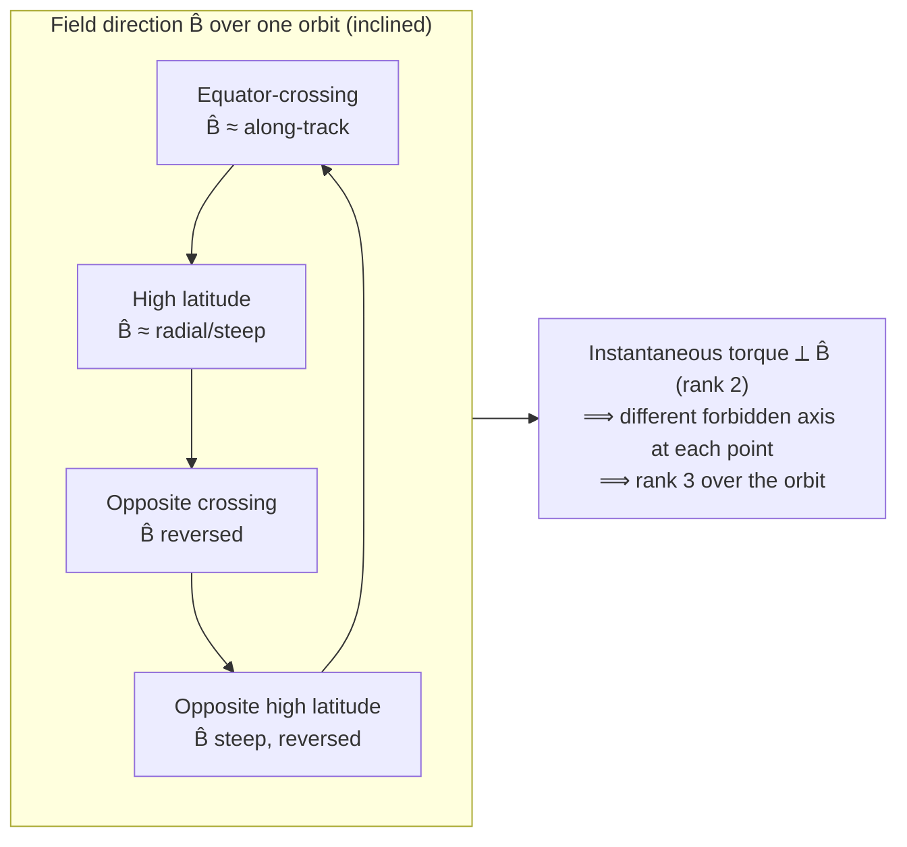
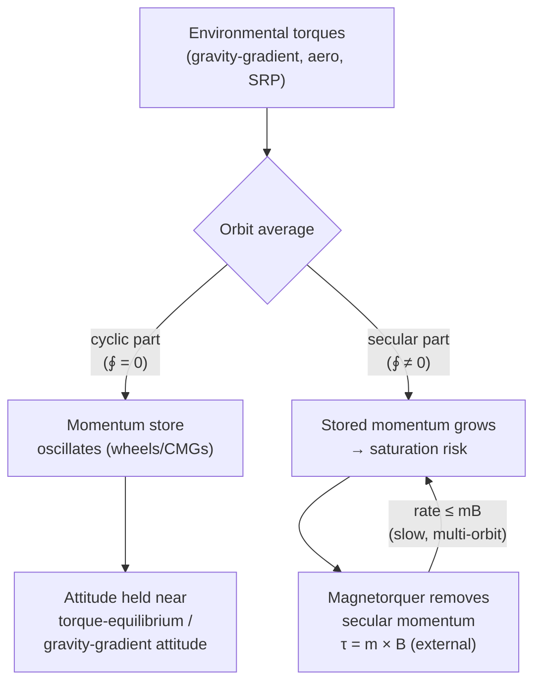
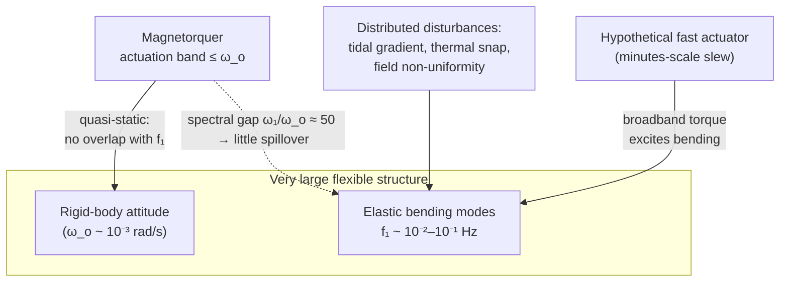

# Geomagnetic Attitude Control and Slew Dynamics of Very Large Flexible Space Structures

**Christopher I. V. Farmer, LL.M. (University of Worcester) · Independent Researcher · civfarmer@gmail.com**

*Preprint — submitted; pending peer review. Phase II Theory Paper. July 2026.*

> **Scope note.** This is a general engineering paper on the attitude dynamics and control of a *very large, flexible, high-inertia space structure* — the generic class that includes large space-based solar-power platforms, kilometre-scale radio-astronomy apertures and interferometers, and large Earth- or space-observation platforms. It treats one narrow physical question: how such a structure can be reoriented and stabilised propellantlessly by *magnetorquers* interacting with the geomagnetic field, and why the physics makes this slow. The analysis is deliberately platform-agnostic — the attitude-control physics derived here depends only on the structure's mass distribution, flexibility, and orbit, not on its payload or purpose. The paper contains no weapon, launcher, projectile, munition, firing, or targeting/vectoring content of any kind, describes no such system, and is not a study of any weapons platform. All numerical examples are explicitly labelled *illustrative calculations*: they use representative parameters to establish orders of magnitude and are not measurements, mission data, or claimed results.

---

## Abstract

Reorienting a multi-kilometre-scale space structure poses a control problem qualitatively different from that of a conventional satellite, because the moment of inertia grows as the fourth power of the structure's linear dimension while the environmental fields that can be exploited for propellantless actuation do not. This paper develops the physics of *magnetic* attitude control for such structures from first principles: the torque law τ = m × B and its instantaneous rank-two under-actuation; a tilted-dipole and IGRF description of the geomagnetic field and its scaling with altitude and latitude; the rest-to-rest slew problem under a bounded, direction-constrained magnetic torque; secular-versus-cyclic momentum management; the dominance of gravity-gradient torque at kilometre scale; and the coupling of all of these to the low-frequency bending modes of a flexible truss. A clearly-labelled illustrative calculation for a representative 1-km, 10⁵-kg reference platform shows that a 90° eigenaxis slew in ~7 minutes would require a magnetic dipole of order 10¹⁰ A·m² — roughly seven to eight orders of magnitude beyond any flown magnetorquer and thermally impossible for the structure itself — whereas physically achievable dipoles (10⁴–10⁷ A·m²) yield slew times of hours to days. The central conclusion is that magnetic-only control of a very large structure is *attitude-stabilising but slow*: it is well matched to libration damping, momentum management, and quasi-static repointing within a gravity-gradient-dominated envelope, and its inherently low bandwidth is in fact a virtue, keeping the actuation spectrum well below the structure's first bending mode and thereby avoiding the control–structure interaction that would otherwise wreck a fast slew.

**Keywords:** magnetorquer; magnetic attitude control; geomagnetic field; IGRF; large space structure; flexible spacecraft; gravity-gradient stabilisation; control–structure interaction; slew maneuver; momentum management; under-actuation; solar-power satellite.

---

## 1. Introduction

The largest structures humanity has flown — the International Space Station spans about 109 m — are small compared with the platforms that recur in the engineering literature on space-based solar power, kilometre-scale radio apertures, and large observation systems. Glaser's original solar-power-satellite reference design, elaborated by NASA and the U.S. Department of Energy in the 1970s, envisaged an on-orbit structure roughly 10 km by 5 km with a mass of tens of thousands of tonnes.[^glaser] Radio-astronomy concepts for very-low-frequency observation from space, and large sparse-aperture imaging platforms, likewise reach into the multi-kilometre regime. Whatever their purpose, all such structures share three attributes that dominate their attitude dynamics and separate them decisively from ordinary spacecraft: an enormous moment of inertia, extreme structural flexibility with very low natural frequencies, and a physical extent over which the environment itself varies appreciably from one end of the body to the other.

Attitude control of a conventional rigid satellite is, by comparison, a solved and well-textbooked problem.[^wertz][^sidi][^markley] Reaction wheels and control-moment gyroscopes store and exchange angular momentum internally; thrusters supply external torque; magnetorquers trim, damp, and desaturate. The difficulty at kilometre scale is not that any one of these mechanisms stops working, but that the *ratios* change. The moment of inertia of a slender structure of fixed areal density scales as the fourth power of its length (mass ∝ length², lever arm² ∝ length²), so the torque required to move it on a given timescale grows explosively, while the geomagnetic field that a propellantless magnetorquer can push against does not scale at all. Simultaneously, the structure's lowest elastic frequency falls, so that the control system's own actuation increasingly overlaps the frequency band of the bending modes it must not excite. The design problem becomes one of *timescales and spectra* rather than of raw authority.

This paper concentrates on the propellantless option — magnetic actuation — because it is the mechanism whose limits are least intuitive at scale and most physically instructive. A magnetorquer consumes only electrical power, carries no propellant to be exhausted, and imposes no plume or contamination on a delicate multi-kilometre structure; these are exactly the properties one wants for a long-lived platform. Its liabilities are equally fundamental: the torque it produces is bounded by the weak geomagnetic field, and at every instant that torque is confined to a plane, because the cross product of the dipole with the field can produce no component along the field. Magnetic control is thus doubly constrained — weak and under-actuated — and the interesting physics lies in how those constraints interact with the mass, flexibility, and orbital motion of a very large body.

The argument proceeds as follows. Section 2 sets out the magnetic torque law, the realizable dipole of a large structure, the instantaneous rank-two under-actuation and its standard cross-product control law, and the way orbital motion restores full controllability over an orbit. Section 3 describes the geomagnetic environment through the tilted-dipole approximation and the International Geomagnetic Reference Field (IGRF), and tabulates the field's scaling with altitude and latitude. Section 4 is the core slew analysis: it derives the rest-to-rest maneuver time under bounded torque, works the "seven-minute" question in full for a labelled reference platform, and extracts a scaling law showing why larger structures are unavoidably slower. Section 5 treats momentum management and the secular-versus-cyclic distinction that makes magnetic control useful despite its weakness. Section 6 shows that at kilometre scale gravity-gradient torque dominates the magnetic torque by orders of magnitude, converting the problem into one of damping and trimming about a passively stable equilibrium. Section 7 develops the flexible-structure dynamics — low eigenfrequencies, control–structure interaction, and the differential effects across a very long body — and argues that the slowness of magnetic control is, for a flexible structure, a feature rather than a bug. Section 8 synthesises a feasibility envelope, and Section 9 concludes.

A word on method. Every numerical statement below is an *illustrative calculation*: it uses transparent, representative parameters, states its assumptions, and is meant to fix an order of magnitude, not to report a result. Where the literature supplies a standard formula or value, it is cited to a primary or authoritative source. No mission data are used and none are implied.

## 2. Magnetic Actuation and Its Instantaneous Under-Actuation

### 2.1 The torque law

A magnetorquer is, physically, a current loop — a coil, a wound rod, or in principle a conductive path around the structure itself — that carries a controllable current and thereby presents a magnetic dipole moment **m** (units A·m²) to the ambient field. In an external magnetic flux density **B** (units T = Wb·m⁻² = kg·s⁻²·A⁻¹) the dipole experiences a mechanical torque

    τ = m × B.                                                        (1)

The dipole itself, for a coil of N turns each enclosing area A carrying current I, is

    m = N I A n̂,                                                     (2)

with n̂ the unit normal to the coil in the right-hand sense of the current. Equations (1)–(2) are the whole of the actuator physics; everything that follows is a consequence of their structure and of the smallness of |**B**|.

The magnitude of the available torque is

    |τ| = |m| |B| sin θ,                                             (3)

where θ is the angle between **m** and **B**. Two features are immediate. First, the torque is *bounded by the field*: for a given dipole, no orientation produces more torque than |m||B|, achieved when **m** ⊥ **B**. Second, the torque *vanishes* when **m** ∥ **B**: a dipole aligned with the field produces no torque at all. The consequences of that second fact are the subject of §2.3.

### 2.2 The realizable dipole of a large structure

For a small satellite the dipole is set by hardware limits. Flight magnetorquers on CubeSats typically deliver 0.1–1.5 A·m²; dedicated torque rods on larger platforms reach tens to a few hundred A·m².[^ovchinnikov][^satsearch] A very large structure changes this budget qualitatively, because the achievable dipole scales with *enclosed area* (Eq. 2), and area scales as the square of the structure's linear dimension. A single conductive loop routed around a kilometre-scale structure encloses an area many orders of magnitude larger than any coil that fits inside a spacecraft bus.

> **Illustrative calculation 1 — a distributed magnetorquer.** Consider a single-turn conductive loop routed around the perimeter of a 1 km × 1 km region of a large platform, enclosing A = 1.0 × 10⁶ m², with perimeter ℓ = 4.0 × 10³ m. Take an aluminium conductor of cross-section a = 1 cm² = 1.0 × 10⁻⁴ m² (resistivity ρ = 2.82 × 10⁻⁸ Ω·m, density 2.70 × 10³ kg·m⁻³). Its resistance is R = ρℓ/a = 1.13 Ω and its mass is ρ_mass·ℓ·a ≈ 1.08 × 10³ kg. The dipole is m = I·A, and the ohmic power is P = I²R:
>
> | Dipole m (A·m²) | Loop current I (A) | Power P (W) | Current density (A·m⁻²) |
> |---|---|---|---|
> | 1 × 10⁵ | 0.10 | 1.1 × 10⁻² | 1 × 10³ |
> | 1 × 10⁶ | 1.0 | 1.1 | 1 × 10⁴ |
> | 1 × 10⁷ | 10 | 1.1 × 10² | 1 × 10⁵ |
> | 1 × 10¹⁰ | 1.0 × 10⁴ | 1.1 × 10⁸ | 1 × 10⁸ |
>
> A dipole of 10⁵–10⁷ A·m² is therefore physically plausible for a kilometre-scale structure at modest power (≲ 10² W) and mass (≈ 1 t of conductor) — some four to seven orders of magnitude beyond a CubeSat torquer, purely from the area term. By contrast a dipole of 10¹⁰ A·m² would demand 10⁴ A through the same loop, dissipating ~113 MW and driving a current density of 10⁸ A·m⁻², one to two orders of magnitude beyond the sustained limit of any spaceworthy conductor. It is thermally impossible independent of any other consideration. We will use the *feasible band* 10⁴–10⁷ A·m² as the reference envelope for a very large structure and treat 10⁵ A·m² as a conservative baseline and 10⁷ A·m² as an aggressive one.

The point is not the specific loop geometry — a real platform would use distributed torque rods or several loops — but the scaling: the useful upper bound on m for a very large structure is set by *power, thermal dissipation, and conductor mass*, and lands around 10⁷ A·m², not around the value of any component in a catalogue.

### 2.3 Instantaneous rank-two under-actuation

Return to Eq. (1). Because the torque is a cross product, it is *always perpendicular to* **B**. Whatever dipole the control system commands, the resulting torque lies in the two-dimensional plane orthogonal to the instantaneous field direction; the component of any desired torque along **B** is unattainable. The actuator is, at every instant, of rank two, not three: it can produce torque about two independent axes but never about the local field axis.

Formally, suppose the control law demands a torque τ_d. Decompose it as τ_d = τ_d,⊥ + (τ_d · B̂) B̂, where B̂ = **B**/|B|. Only τ_d,⊥ can be produced. The minimum-norm dipole that produces it is the standard *cross-product control law*,

    m_cmd = (B × τ_d) / |B|².                                        (4)

Substituting Eq. (4) into Eq. (1) and using the vector triple product (a × b) × c = b(a·c) − a(b·c),

    τ = m_cmd × B = τ_d − B̂ (τ_d · B̂) = τ_d,⊥.                     (5)

Equation (5) makes the loss explicit: the realized torque is the projection of the demand onto the plane perpendicular to the field, and the along-field component is discarded. This is the projection that every practical magnetic controller — from the classical Stickler–Alfriend system[^stickler] to modern periodic-LQR and passivity-based designs[^psiaki][^wisniewski][^lovera] — either performs directly or reproduces implicitly. It is the origin of the *efficiency penalty* that will reappear in the slew analysis: even a favourably oriented maneuver loses, on average, a substantial fraction of its nominal torque to the perpendicularity constraint.

### 2.4 Restoration of controllability by orbital motion

If the field direction B̂ were fixed, the missing axis would be permanently uncontrollable and the structure could never be reoriented about it magnetically. It is *orbital motion* that rescues the situation. As the spacecraft traverses its orbit through the spatially varying geomagnetic field, and as the Earth's tilted dipole rotates beneath it, the field direction seen in the body/orbit frame sweeps around over each orbit. The instantaneously forbidden axis is therefore different at different points of the orbit, and a torque unattainable now becomes attainable a quarter-orbit later.

This is not merely heuristic. Bhat established, by applying nonlinear controllability theory to the time-varying attitude dynamics of a magnetically actuated spacecraft in a Keplerian orbit, that the system is *strongly accessible* wherever the field and its time-derivative are linearly independent, and *controllable* when the field is periodic in time along the orbit.[^bhat] The geomagnetic field along an inclined orbit is, to good approximation, periodic with the orbital period, and over one period B̂ spans a set of directions that is full-dimensional; the orbit-averaged actuation map is then of rank three even though the instantaneous map is of rank two. The important qualification is geometric: in a near-equatorial orbit the field remains nearly parallel to the orbit normal throughout, so B̂ barely sweeps, and controllability about that axis becomes weak and slow. Controllability improves with inclination and is strongest for polar and high-inclination orbits, where the field direction varies most over an orbit. The surveys of Silani & Lovera and of Ovchinnikov & Roldugin catalogue the control laws that exploit this time-varying controllability.[^silani][^ovchinnikov]

*Figure 1. Instantaneous rank-two under-actuation and its restoration over an orbit. At any instant the achievable torque is confined to the plane perpendicular to the field; because the field direction sweeps over an inclined orbit, the union of achievable directions over one orbital period is three-dimensional, and the system is controllable in the orbit-averaged sense (Bhat, 2005).*

## 3. The Geomagnetic Environment

### 3.1 The tilted-dipole approximation

To lowest order the geomagnetic field is that of a magnetic dipole at the Earth's centre, tilted about 9.5°–11° from the rotation axis. The dipole moment of the Earth is m_E ≈ 7.94 × 10²² A·m².[^wertz][^dipole] In the dipole approximation the field magnitude at geocentric radius r and geomagnetic latitude λ_m is

    |B|(r, λ_m) = B₀ (R_E / r)³ √(1 + 3 sin²λ_m),                     (6)

where R_E = 6.371 × 10⁶ m is the mean Earth radius and B₀ = μ₀ m_E / (4π R_E³) is the reduced equatorial surface field. Evaluating,

    B₀ = (1.0 × 10⁻⁷)(7.94 × 10²²) / (2.586 × 10²⁰) ≈ 3.0 × 10⁻⁵ T (30 μT),

with the historically quoted value ≈ 3.12 × 10⁻⁵ T reflecting the slowly weakening dipole of earlier epochs.[^dipole] Equation (6) captures the two scalings that matter for actuation: the field falls as the inverse cube of geocentric distance, and at fixed radius it is twice as strong over the magnetic poles (λ_m = 90°) as over the magnetic equator (λ_m = 0°). At the surface the total field ranges from about 25 μT near the magnetic equator to about 65 μT near the poles, consistent with Eq. (6) once the non-dipole terms and the offset of the dipole are included.

### 3.2 Altitude and latitude scaling

Because the actuator torque is linear in |B| (Eq. 3), the inverse-cube altitude dependence directly weakens magnetic control at higher orbits. Illustrative calculation 2 tabulates Eq. (6) for a representative reduced dipole B₀ = 30 μT.

> **Illustrative calculation 2 — field versus altitude.** Equatorial (λ_m = 0) and polar (λ_m = 90°) dipole-model field magnitudes:
>
> | Altitude h (km) | r (km) | (R_E/r)³ | |B| equator (μT) | |B| pole (μT) |
> |---|---|---|---|---|
> | 0 | 6371 | 1.000 | 30.0 | 60.0 |
> | 200 | 6571 | 0.911 | 27.3 | 54.7 |
> | 400 | 6771 | 0.833 | 25.0 | 50.0 |
> | 600 | 6971 | 0.763 | 22.9 | 45.8 |
> | 800 | 7171 | 0.701 | 21.0 | 42.1 |
> | 1000 | 7371 | 0.646 | 19.4 | 38.7 |
> | 2000 | 8371 | 0.441 | 13.2 | 26.5 |
> | 35 786 (GEO) | 42 157 | 3.45 × 10⁻³ | 0.10 | 0.21 |
>
> In low Earth orbit the field is of order 20–50 μT; by geostationary altitude it has fallen to ~0.1 μT, roughly 250 times weaker, which is why magnetic actuation is essentially a low-Earth-orbit technique. For the slew analysis of §4 we adopt a representative LEO value B_rep = 3.0 × 10⁻⁵ T; this is at the upper end of the LEO band and therefore *optimistic*, so that the infeasibility conclusions are conservative. Slew times scale as B^(−1/2) (Eq. 10), so halving the assumed field lengthens them by only ~41%.

### 3.3 The IGRF and higher-order structure

For any quantitative control design the dipole is insufficient; the field must be represented by the International Geomagnetic Reference Field (IGRF), the standard spherical-harmonic model maintained by the International Association of Geomagnetism and Aeronomy. The IGRF expresses the scalar potential as a truncated spherical-harmonic series (degree and order 13 for the main field), with Gauss coefficients updated every five years and a secular-variation model between epochs. The current generation, IGRF-14, was adopted by the IAGA Division V working group in November 2024; it provides a definitive main-field model for epoch 2020.0, a main-field model for epoch 2025.0, and a predictive secular-variation model for 2025.0–2030.0.[^igrf14][^igrf13] Two features of the real field are practically important and absent from the pure dipole: the field is *not* symmetric about the geographic axis (hence the ~11° dipole tilt and the substantial quadrupole and octupole terms), and there is a pronounced regional minimum, the South Atlantic Anomaly, where the field over the South Atlantic and South America is depressed by up to ~30% relative to the dipole value. An attitude controller that predicts the available torque from an on-board field model must therefore carry at least a low-degree IGRF, not Eq. (6), and must expect the torque authority to vary around the orbit and to be systematically weak over the anomaly.

### 3.4 The field as seen by the structure

Two frame effects close the environmental picture. First, the field direction in the orbit frame rotates roughly *twice per orbit* for an inclined orbit — the geometry that underlies §2.4's controllability argument — so the "forbidden" torque axis precesses continuously. Second, and specific to very large structures, the field is not uniform across the body: over a body of radial extent Δx the fractional variation of the dipole field is of order 3Δx/r, i.e. ~4 × 10⁻⁴ over a 1-km radial span at 400 km, and the field *direction* rotates slightly from one end of a kilometre-scale body to the other. These differential effects are negligible for the net torque but must be retained in any high-fidelity model of distributed current elements (§7.5).

## 4. Slew Dynamics Under Bounded Magnetic Torque

### 4.1 The rest-to-rest eigenaxis maneuver

Consider the idealised problem of rotating the structure through an angle Δθ about a fixed principal (eigen-) axis, starting and ending at rest, under a torque of bounded magnitude τ about that axis. The time-optimal profile for a double-integrator with a symmetric torque bound is the classical *bang–bang* maneuver: accelerate at the maximum angular acceleration α = τ/I for the first half of the maneuver, then decelerate at −α for the second half.[^wie][^sidi] With I the relevant moment of inertia, the angle accumulated is

    Δθ = ¼ α t²  ⟹  t = 2 √(Δθ / α) = 2 √(I Δθ / τ).                 (7)

Equation (7) is the workhorse of this section. It states the physically crucial fact that the maneuver time grows as the *square root* of the moment of inertia and falls only as the square root of the torque: to make a body of ten-thousand-fold greater inertia slew in the same time requires a hundred-fold greater torque. For magnetic actuation, where τ is capped by the weak field (Eq. 3), this is a severe constraint.

For a magnetic maneuver the constant-torque idealisation is optimistic in two ways that we track explicitly. The achievable torque is not τ = mB at all times but τ = mB·sin θ (Eq. 3) with θ the dipole–field angle, and only the perpendicular projection about the desired axis is useful (Eq. 5). We therefore write the *effective* torque as

    τ_eff = η · m · B,   with 0 < η < 1,                             (8)

an orbit-averaged efficiency η that captures the perpendicularity loss and the finite duty about a fixed slew axis. Favourable high-inclination geometry gives η ≈ 0.5–0.7; unfavourable geometry (including any span of orbit where the desired axis lies near B̂) drives η toward zero. Slew times computed with τ = mB (η = 1) are thus *lower bounds*; realistic times are longer by roughly 1/√η ≈ 1.2–1.4× at best.

### 4.2 The reference platform

> **Illustrative calculation 3 — reference platform R1.** We adopt a slender reference structure:
> - Length L = 1.0 × 10³ m (1 km); total mass M = 1.0 × 10⁵ kg (100 t); linear density m′ = 100 kg·m⁻¹.
> - Modelled as a uniform thin rod, the transverse moment of inertia through the centre of mass is I_T = ML²/12 = 8.33 × 10⁹ kg·m². The moment of inertia about the long (slender) axis, I_L, is smaller by the square of the ratio of cross-sectional radius to length and is negligible: for a 5-m cross-sectional radius, I_L ~ 10⁶ kg·m² ≪ I_T. Hence the inertia difference ΔI ≡ I_T − I_L ≈ I_T.
> - Orbit: circular, altitude 400 km, r = 6.771 × 10⁶ m. Mean motion ω_o = √(μ_E/r³) with μ_E = 3.986 × 10¹⁴ m³·s⁻²: ω_o² = 1.284 × 10⁻⁶ s⁻², ω_o = 1.133 × 10⁻³ rad·s⁻¹, orbital period T_orb = 2π/ω_o = 5.54 × 10³ s ≈ 92.4 min.
> - Representative field B_rep = 3.0 × 10⁻⁵ T.
>
> R1 is deliberately *modest* for a "very large" structure — heavier or longer platforms only increase I_T and lengthen every slew below. It is a lower bound on difficulty, not an upper one.

### 4.3 Slew time versus dipole, and the seven-minute question

With Δθ = 90° = π/2 = 1.5708 rad and I_T = 8.33 × 10⁹ kg·m², the product I_T·Δθ = 1.31 × 10¹⁰ kg·m²·rad. Using τ = mB_rep (the optimistic η = 1 bound), Eq. (7) gives the following.

> **Illustrative calculation 4 — 90° slew time versus dipole (R1, η = 1 lower bound).**
>
> | Dipole m (A·m²) | Torque τ = mB (N·m) | Slew time t (Eq. 7) | Feasibility (from Illus. Calc. 1) |
> |---|---|---|---|
> | 1 × 10² | 3.0 × 10⁻³ | 4.18 × 10⁶ s ≈ 48 days | conventional torque rod |
> | 1 × 10³ | 3.0 × 10⁻² | 1.32 × 10⁶ s ≈ 15 days | large torque rod |
> | 1 × 10⁴ | 3.0 × 10⁻¹ | 4.18 × 10⁵ s ≈ 4.8 days | feasible (distributed) |
> | 1 × 10⁵ | 3.0 | 1.32 × 10⁵ s ≈ 37 h | feasible (baseline) |
> | 1 × 10⁶ | 3.0 × 10¹ | 4.18 × 10⁴ s ≈ 11.6 h | feasible |
> | 1 × 10⁷ | 3.0 × 10² | 1.32 × 10⁴ s ≈ 3.7 h | feasible (aggressive) |
> | 1 × 10⁸ | 3.0 × 10³ | 4.18 × 10³ s ≈ 70 min | infeasible dipole |
> | 1 × 10⁹ | 3.0 × 10⁴ | 1.32 × 10³ s ≈ 22 min | infeasible dipole |
> | 1 × 10¹⁰ | 3.0 × 10⁵ | 4.18 × 10² s ≈ 7.0 min | thermally impossible |
>
> Reading the table against the achievable band of §2.2 (m ≲ 10⁷ A·m²), the fastest *physically achievable* 90° magnetic slew of R1 is of order **a few hours** in the optimistic η = 1 limit, and roughly **half a day or more** once the efficiency penalty (η ≈ 0.5) and the need to avoid exciting structural modes (§7) are included.

Now the seven-minute question directly. Invert Eq. (7) for the torque required to complete Δθ = π/2 in t = 420 s:

    τ_req = 4 I_T Δθ / t² = 4 (8.33 × 10⁹)(1.5708) / (420)² = 2.97 × 10⁵ N·m.                (9)

The dipole that would supply this against B_rep is

    m_req = τ_req / B_rep = 2.97 × 10⁵ / 3.0 × 10⁻⁵ ≈ 9.9 × 10⁹ ≈ 1.0 × 10¹⁰ A·m².            (10)

This is the number that answers the question. A ~7-minute 90° slew of a kilometre-scale, 10⁵-kg structure would require a magnetic dipole of order **10¹⁰ A·m²**. That is:

- about **10⁷–10⁸ times** larger than any flown magnetorquer (10²–10³ A·m²);
- about **10³ times** larger than the aggressive distributed-loop dipole of Illustrative calculation 1 (10⁷ A·m²);
- realized, if one insisted on the km-loop of §2.2, only at ~113 MW of continuous dissipation and a conductor current density of 10⁸ A·m⁻², one to two orders beyond the sustained limit of any spaceworthy conductor — i.e. it melts the loop.

And this is the *best case* (η = 1). Including the perpendicularity/duty penalty, the demand rises to m_req/√η ~ 1.4 × 10¹⁰ A·m² and the actuator cannot in any event deliver full torque about a fixed slew axis continuously through the maneuver, because for part of every orbit the desired axis lies too near B̂ (Eqs. 3, 5). The seven-minute magnetic slew is therefore **not physically consistent** — not marginally, but by many orders of magnitude, and for two independent reasons (dipole magnitude and duty cycle) at once. The honest conclusion is that magnetic-only reorientation of a very large structure is intrinsically a process of **hours to days**, not minutes.

### 4.4 Duty cycle and the efficiency penalty, quantified

It is worth being explicit about the "duty cycle" the question invokes. Two distinct factors reduce the effective torque below mB. The first is the *instantaneous* perpendicularity loss (Eq. 3): averaged over random relative orientations of a fixed desired axis and a sweeping B̂, ⟨sin θ⟩ = π/4 ≈ 0.79, but the *useful* component about the fixed axis (Eq. 5) averages lower. The second is the *deadband* over the fraction of the orbit where the desired torque axis lies within a small cone of B̂ and essentially no useful torque is available; over that arc the maneuver stalls and must wait for the geometry to improve. For a favourable high-inclination orbit these combine to η ≈ 0.5–0.7; for an equatorial orbit and a slew about the near-constant field axis, η → 0 and the maneuver is effectively impossible magnetically regardless of dipole. There is, in other words, no duty cycle at which a 10¹⁰-A·m² dipole becomes available, and even if there were, no orbit geometry at which it could be applied continuously about a single axis. Both the required dipole and the required duty are unphysical.

### 4.5 Why larger is unavoidably slower: a scaling law

The reference platform makes one case; a scaling argument makes the general one. Suppose the structure is scaled up self-similarly at fixed *areal* mass density (mass M ∝ L²) and fixed *areal* dipole density (the distributed torquer of §2.2 gives m ∝ enclosed area ∝ L²). Then the transverse inertia scales as I ∝ M L² ∝ L⁴, the torque scales as τ = mB ∝ L², and the minimum slew time (Eq. 7) scales as

    t ∝ √(I/τ) ∝ √(L⁴/L²) = L.                                       (11)

Even under the *most favourable* assumption — that the magnetorquer grows with the structure's whole area — the minimum magnetic slew time grows at least *linearly* with the structure's linear dimension. If mass instead scales volumetrically (M ∝ L³), t ∝ L^(3/2), worse still. Bigger structures are not merely harder to slew; they are harder in a way no amount of area-scaled magnetorquer can outrun.

> **Illustrative calculation 5 — slew-time scaling with size.** Anchoring Eq. (11) at R1 (L = 1 km, m = 10⁶ A·m², t ≈ 11.6 h from Illus. Calc. 4), and holding areal mass density (0.1 kg·m⁻²) and areal dipole density (1 A·m²·m⁻²) fixed:
>
> | Linear size L (km) | Inertia I_T ∝ L⁴ (kg·m²) | Area-scaled dipole m ∝ L² (A·m²) | Min. 90° slew time ∝ L |
> |---|---|---|---|
> | 0.5 | 5.2 × 10⁸ | 2.5 × 10⁵ | ≈ 5.8 h |
> | 1 | 8.3 × 10⁹ | 1.0 × 10⁶ | ≈ 11.6 h |
> | 2 | 1.3 × 10¹¹ | 4.0 × 10⁶ | ≈ 23 h |
> | 5 | 5.2 × 10¹² | 2.5 × 10⁷ | ≈ 2.4 days |
> | 10 | 8.3 × 10¹³ | 1.0 × 10⁸ | ≈ 4.8 days |
>
> A 10-km platform of the Glaser class, even with a 10⁸-A·m² area-scaled dipole (already at the edge of the thermal envelope), slews 90° in about five days at best.

## 5. Momentum Management, Secular and Cyclic Torque

### 5.1 Angular momentum bookkeeping

The rotational equation of motion for a structure carrying an internal momentum store (reaction wheels or CMGs of total stored momentum h_w), written in the body frame, is

    I ω̇ + ω × (I ω + h_w) + ḣ_w = τ_gg + τ_mag + τ_env,               (12)

with τ_gg the gravity-gradient torque (§6), τ_mag = m × B the magnetic control torque, and τ_env the residual environmental torques (aerodynamic in LEO, solar-radiation pressure, and higher-order magnetic). The *total* system angular momentum H = Iω + h_w evolves, in inertial axes, only under *external* torques:

    dH/dt |_inertial = τ_gg + τ_mag + τ_env.                          (13)

Internal actuators (wheels, CMGs) can redistribute momentum between the structure and the store — they can slew the body by spinning up a wheel — but they cannot change H; only external torques can. This is the division of labour at the heart of large-structure attitude control.

### 5.2 Secular versus cyclic disturbance

Environmental torques divide into two parts by their behaviour over an orbit. The *cyclic* part integrates to zero over one orbital period and merely causes the stored momentum to oscillate; the *secular* part has a non-zero orbit average and causes the stored momentum to grow without bound. A momentum store of finite capacity saturates on the secular component, after which it can absorb no more and the body attitude begins to drift. The purpose of an *external* trim torque is to remove the secular momentum — "desaturation" or "momentum dumping" — resetting the store.

For a very large structure the dominant secular source is the gravity-gradient torque evaluated away from its equilibrium (§6): a slender body held at an attitude offset from its gravity-gradient equilibrium experiences a torque whose orbit average need not vanish, and whose *magnitude* (§6.1) dwarfs the available magnetic torque. This is the crux of §6.

### 5.3 Magnetic momentum management and why it is the right job for the actuator

Magnetorquers are the standard external actuator for momentum management precisely because Eq. (13) requires an *external* torque and magnetic torque is the only propellantless external torque available in LEO. The orbit-averaged controllability of §2.4 is exactly what is needed: although at any instant the magnetic torque cannot point along B̂, over an inclined orbit the achievable *secular* (orbit-averaged) torque spans all three axes, so secular momentum accumulated in any direction can be bled off over one or a few orbits.[^stickler][^markley][^ovchinnikov] The desaturation law is a cross-product law (Eq. 4) driven by the momentum error,

    τ_cmd = −k (h_w − h_ref),   m_cmd = (B × τ_cmd)/|B|²,             (14)

for a positive gain k. The rate at which magnetic torque can remove momentum is bounded by mB (of order 3 N·m at m = 10⁵ A·m², 300 N·m at m = 10⁷ A·m² for R1), so desaturation of a large secular momentum is itself a slow, multi-orbit process — again, stabilising but slow.

This is the architecture flown on the largest structures actually operated. On the International Space Station, four control-moment gyroscopes hold attitude and store momentum while the vehicle is commanded toward the *torque-equilibrium attitude* — the attitude at which the orbit-averaged sum of gravity-gradient, aerodynamic, and other environmental torques is minimised — precisely to keep the secular momentum small; when the CMGs approach saturation, an external torque source unloads them.[^wie1989] The lesson transfers directly to a kilometre-scale platform, with magnetorquers as the external unloading torque and the gravity-gradient equilibrium as the natural attitude to hold.

*Figure 2. Momentum management for a large structure. Internal stores (wheels/CMGs) absorb the cyclic disturbance and effect fast internal exchanges; only an external torque can remove the secular momentum, and in LEO the propellantless external option is the magnetorquer, whose bounded torque makes desaturation a slow, multi-orbit process.*

## 6. Gravity-Gradient Torque and Passive Stabilisation

### 6.1 The gravity-gradient torque and its dominance at scale

A rigid body in orbit experiences a torque because the gravitational pull on its near side exceeds that on its far side. For a body with inertia tensor **I** and nadir (local-vertical) unit vector n̂, the gravity-gradient torque is

    τ_gg = 3 (μ_E / r³) (n̂ × I·n̂) = 3 ω_o² (n̂ × I·n̂),                (15)

using ω_o² = μ_E/r³ for a circular orbit.[^hughes][^wertz] For a slender body at attitude angle φ from the local vertical, the magnitude is

    |τ_gg| = (3/2) ω_o² |I_T − I_L| sin 2φ ≈ (3/2) ω_o² I_T sin 2φ,     (16)

since I_L ≪ I_T for a slender structure. The peak (sin 2φ = 1) is what makes kilometre scale distinctive.

> **Illustrative calculation 6 — gravity-gradient torque on R1.** With ω_o² = 1.284 × 10⁻⁶ s⁻² (400 km) and I_T = 8.33 × 10⁹ kg·m²,
>
>     |τ_gg|_max = (3/2)(1.284 × 10⁻⁶)(8.33 × 10⁹) ≈ 1.6 × 10⁴ N·m.
>
> Compare this with the magnetic torque available to R1: 3 N·m at the baseline dipole (10⁵ A·m²), 300 N·m at the aggressive dipole (10⁷ A·m²). The peak gravity-gradient torque exceeds even the aggressive magnetic torque by **a factor of ~50**, and the baseline magnetic torque by a factor of ~5000. A magnetic dipole able merely to *balance* the peak gravity-gradient torque would need m = |τ_gg|/B ≈ 1.6 × 10⁴ / 3.0 × 10⁻⁵ ≈ 5 × 10⁸ A·m² — again far outside the feasible band.

The consequence is structural to the whole control problem: for a very large elongated body in LEO, **gravity-gradient torque is the dominant attitude torque**, and magnetic actuation is a small perturbation on top of it. Magnetorquers cannot fight the gravity gradient; they can only operate *within the envelope it defines*, near its equilibrium.

### 6.2 Gravity-gradient stabilisation and libration

That the gravity gradient dominates is, fortunately, mostly good news, because the gravity-gradient torque is *restoring*: it possesses stable equilibria that provide passive attitude stabilisation without any actuation at all. A slender body is gravity-gradient stable with its long axis — the axis of *minimum* moment of inertia — aligned to the local vertical, pointing along the nadir–zenith line. This is the principle of the gravity-gradient boom, used since the earliest days of spaceflight, and it is analysed in full in the standard texts.[^hughes][^sidi][^wertz] The general stability conditions (the Lagrange region) require the maximum-inertia axis along the orbit normal and the minimum-inertia axis along the local vertical; a slender structure with a single long axis satisfies them naturally when that axis hangs vertically.

The equilibrium is stable but *undamped*: displaced from it, the structure oscillates — librates — indefinitely, because the gravity-gradient torque is conservative. The libration frequencies are of the order of the orbital rate. For the classical slender ("dumbbell") body the in-plane pitch libration frequency is

    ω_pitch = √3 · ω_o,                                              (17)

so that for R1, ω_pitch = 1.73 × 1.133 × 10⁻³ = 1.96 × 10⁻³ rad·s⁻¹, a libration period of ≈ 53 min, roughly 0.58 of the orbital period.[^hughes] Roll and yaw librations have frequencies of the same order set by the inertia ratios. These are the slow rigid-body modes the controller must manage; note they are far below the *elastic* modes of §7.

### 6.3 Magnetic libration damping: the natural role of the actuator

Since the gravity gradient supplies the stiffness but no damping, the natural and classical role of a weak actuator is to supply the *damping*: to bleed energy out of the libration so the structure settles to its gravity-gradient equilibrium. This is precisely the regime in which magnetic torque is not merely adequate but ideal. It needs to counter only the slow, small residual libration torques, not the full gravity-gradient stiffness, and it has an entire orbit over which to act. The foundational demonstration is Stickler & Alfriend's elementary magnetic control system for gravity-gradient/momentum-bias spacecraft, which achieves acquisition, libration (nutation) damping, and momentum control with magnetorquers alone;[^stickler] Wisniewski & Blanke proved local asymptotic stabilisability of the gravity-gradient equilibrium under *fully magnetic* three-axis control by exploiting the periodicity of the field along the orbit and standard passivity arguments;[^wisniewski] and Psiaki and Lovera & Astolfi supplied periodic-LQR and almost-global nonlinear designs respectively.[^psiaki][^lovera] The unifying picture is consistent across this literature and with the physics above: magnetic control damps and trims a gravity-gradient-stabilised structure, on the timescale of many orbits, and cannot and need not do more.

### 6.4 The operating envelope

Sections 4–6 combine into a single statement of what magnetic-only control of a very large structure can do. It cannot slew the structure quickly (§4) or overpower the gravity gradient (§6.1). It *can* (i) damp libration about the passively stable gravity-gradient attitude (§6.3); (ii) trim that attitude slowly, and slew the structure between gravity-gradient-compatible orientations over hours to days (§4); and (iii) manage and desaturate stored momentum over multiple orbits (§5). All three are stabilising, low-authority, low-bandwidth functions. The structure is held, fundamentally, by gravity; the magnetorquer keeps it quiet.

## 7. Flexible-Structure Dynamics and Control–Structure Interaction

### 7.1 Low structural eigenfrequencies

A multi-kilometre truss is not rigid; it is a distributed elastic body whose lowest bending modes have very low natural frequencies, and those frequencies are the single most important flexible-body parameter for control design. Modelling the primary structural member as a uniform Euler–Bernoulli beam of flexural rigidity EI_b (N·m²) and mass per length m′ (kg·m⁻¹), the natural frequencies of transverse bending are

    f_n = (β_n L)² / (2π L²) · √(EI_b / m′) = (β_n L)²/(2π) · √(EI_b / (m′ L⁴)),      (18)

where the (β_n L) are the eigenvalues of the boundary-value problem. A free-floating structure has *free–free* boundary conditions; its two rigid-body modes are at zero frequency (these are the attitude and translation degrees of freedom of §§4–6), and its elastic eigenvalues are (β_n L) = 4.730, 7.853, 10.996, … for n = 1, 2, 3, ….[^blevins][^junkins]

> **Illustrative calculation 7 — fundamental bending frequency of R1.** For L = 1 km, m′ = 100 kg·m⁻¹, and (β₁L) = 4.730, Eq. (18) gives f₁ = (4.730)²/(2π) · √(EI_b/(m′ L⁴)) = 3.56 × 10⁻⁷ · √(EI_b) Hz (with EI_b in N·m²):
>
> | Flexural rigidity EI_b (N·m²) | f₁ (Hz) | ω₁ (rad·s⁻¹) | Period 1/f₁ (s) |
> |---|---|---|---|
> | 1 × 10⁸ | 3.6 × 10⁻³ | 2.2 × 10⁻² | 281 |
> | 1 × 10⁹ | 1.1 × 10⁻² | 7.1 × 10⁻² | 89 |
> | 1 × 10¹⁰ | 3.6 × 10⁻² | 2.2 × 10⁻¹ | 28 |
> | 1 × 10¹¹ | 1.1 × 10⁻¹ | 7.1 × 10⁻¹ | 9 |
>
> The fundamental bending mode of a kilometre-scale truss falls in the *millihertz-to-decihertz* band, with ~0.01 Hz (ω₁ ≈ 0.06 rad·s⁻¹) a representative value. Higher structures push it lower still: from Eq. (18), f₁ ∝ 1/L² at fixed cross-section, so a 10-km member of the same design has a fundamental near 10⁻⁴ Hz. These are extraordinarily low frequencies — periods of tens of seconds to hours — and they are dense: the modal spacing (β_n L)² grows only quadratically, so many modes crowd into a narrow low-frequency band.

### 7.2 Control–structure interaction and spillover

The danger a flexible structure poses to its own controller is *control–structure interaction* (CSI). A controller designed on a rigid-body (or low-order modal) model applies torque that also couples into the neglected elastic modes; if the closed-loop actuation has energy at a structural frequency, it excites that mode. Worse, the same sensors that measure attitude also pick up the elastic deflection, and feeding that back through a controller not designed for it can *destabilise* the structure — the phenomena Balas named *control spillover* (control energy leaking into unmodelled modes) and *observation spillover* (unmodelled modal response corrupting the measurement), which together can drive an otherwise-stable design unstable.[^balas][^meirovitch] For a structure with modes as low and as dense as those of Illustrative calculation 7, spillover is not a refinement but a first-order design constraint. The classical mitigations — collocating actuators and sensors so the plant is passive (negative-imaginary) between them, and rolling the controller gain off well below the first structural frequency — are exactly the tools the large-space-structure control literature developed.[^balas][^meirovitch][^junkins]

### 7.3 The spectral-separation virtue of magnetic control

Here the analysis turns, unexpectedly, in magnetic control's favour. The disqualifying weakness of magnetic actuation for slewing — its low authority and inherently low bandwidth — is exactly the property that makes it *safe* for a flexible structure. The magnetic control torque varies on the orbital timescale (the field sweeps ~twice per orbit, §3.4), so the actuation spectrum is concentrated near and below the orbital rate ω_o ≈ 1.1 × 10⁻³ rad·s⁻¹. The first bending mode sits at ω₁ ≈ 0.06 rad·s⁻¹ (Illustrative calculation 7). The separation ratio is

    ω₁ / ω_o ≈ 0.06 / 1.1 × 10⁻³ ≈ 55,                                (19)

between one and three orders of magnitude depending on stiffness. A magnetic controller operating with bandwidth at or below ω_o therefore has essentially no spectral overlap with the structure's elastic modes: it acts *quasi-statically* on the flexible body, deflecting it slowly rather than ringing it. Where a high-bandwidth actuator commanded to slew in minutes would deposit energy squarely in the ω₁ band and excite large bending oscillations, the magnetorquer's slowness keeps its energy far below f₁. For a very large flexible structure, low control bandwidth is a design *asset*, and magnetic actuation supplies it intrinsically.

### 7.4 Avoiding modal excitation during a slew

The spectral-separation argument also prescribes how any slew — magnetic or otherwise — of such a structure must be commanded: the maneuver profile must contain no significant energy at or above f₁. A bang–bang profile (§4.1) is, in this respect, the *wrong* command for a flexible body, because its discontinuous torque switch is spectrally broadband and rings the modes; the flexible-structure literature replaces it with smooth, band-limited, or input-shaped profiles that notch out the structural frequencies.[^junkins][^wie] Two facts make this benign for the magnetic case. First, the achievable magnetic slew is so slow (hours, §4.3) that its natural profile already lies far below f₁; deliberate command shaping costs essentially nothing. Second, because the maneuver spans many structural periods, the structure moves through a quasi-static succession of equilibria, its bending deflection tracking the slowly varying distributed load rather than oscillating. The maneuver is best understood not as a rigid-body rotation but as a slow morphing of a gently-bent equilibrium shape.

### 7.5 Differential effects across a very long body

Finally, the physical extent of a multi-kilometre structure means several environmental fields vary appreciably from one end to the other, producing distributed loads that a point-mass model misses and that couple directly into the low bending modes.

- **Tidal (gravity-gradient) gradient.** In the orbiting frame the differential gravitational acceleration across the body along the local vertical is 3ω_o² per unit radial distance (the radial term of the Clohessy–Wiltshire equations). For R1 at 400 km, 3ω_o² = 3.85 × 10⁻⁶ s⁻²; across a 500-m radial half-span this is Δa ≈ 1.9 × 10⁻³ m·s⁻² (~2 × 10⁻⁴ g). Distributed over the mass, this is both the source of the stabilising gravity-gradient torque (§6) and a *steady bending and tension load* along the structure — the structure hangs, very slightly, like a slack cable in a tidal field.
- **Field non-uniformity.** As noted in §3.4, the geomagnetic field varies by ~3Δx/r ≈ 4 × 10⁻⁴ over a kilometre span and rotates slightly in direction along the body. For distributed current-carrying elements this yields small differential magnetic forces and torques that must be retained in a high-fidelity model though they are negligible for the net torque.
- **Thermal gradients.** A kilometre-scale structure crossing the day–night terminator experiences a moving sunlight/shadow boundary and large temperature differences between illuminated and shadowed members. The resulting differential thermal expansion produces thermally-induced quasi-static bending and, at the terminator crossing, transient *thermal snap* that can excite the low bending modes — the same mechanism responsible for the well-known thermally-driven jitter of large deployable appendages. For a structure whose modes lie at millihertz, terminator crossings twice per orbit are a periodic excitation uncomfortably close to the low modal band and must be accounted for in both structure and controller design.

*Figure 3. Control–structure interaction. The magnetorquer's actuation band lies far below the first elastic frequency (Eq. 19), so it acts quasi-statically and produces little spillover; a fast (minutes-scale) actuator would deposit energy in the bending band and excite the modes. Distributed environmental disturbances — the tidal gradient, thermal snap at terminator crossings, and field non-uniformity — excite the low modes directly and must be managed structurally.*

## 8. Synthesis: A Feasibility Envelope

The pieces assemble into a coherent and, in retrospect, inevitable picture. The relevant torques for the reference platform R1 span an enormous range, and their hierarchy — not the absolute value of any one — determines what is possible.

> **Illustrative calculation 8 — torque and timescale budget for R1 (400 km).**
>
> | Quantity | Value | Basis |
> |---|---|---|
> | Peak gravity-gradient torque | ~1.6 × 10⁴ N·m | Eq. (16), Illus. Calc. 6 |
> | Magnetic torque, aggressive dipole (10⁷ A·m²) | ~3 × 10² N·m | Eq. (3), B = 30 μT |
> | Magnetic torque, baseline dipole (10⁵ A·m²) | ~3 N·m | Eq. (3) |
> | Dipole to balance peak gravity gradient | ~5 × 10⁸ A·m² | infeasible |
> | Orbital rate ω_o | 1.13 × 10⁻³ rad·s⁻¹ (T = 92 min) | Illus. Calc. 3 |
> | Pitch libration frequency | 1.96 × 10⁻³ rad·s⁻¹ (T ≈ 53 min) | Eq. (17) |
> | First bending frequency f₁ | ~10⁻² Hz (representative) | Illus. Calc. 7 |
> | Fastest feasible 90° magnetic slew | hours (η=1) → ~day (η≈0.5) | Illus. Calc. 4 |
> | 90° slew in 7 min would need | m ≈ 10¹⁰ A·m² / 113 MW | Eqs. (9)–(10): impossible |
>
> Reading down the table: gravity gradient dominates all control torques; magnetic torque is a small trim on top of it; the rigid-body and libration dynamics are slow (tens of minutes to an orbit); the elastic modes are an order of magnitude faster than the librations but still very slow in absolute terms; and the magnetic actuation band sits comfortably below everything elastic. There is a clean ordering of timescales — magnetic actuation ≲ orbital/libration ≪ first bending mode — and it is this ordering that makes the whole system tractable.

The feasibility envelope for *magnetic-only* attitude control of a very large structure is therefore:

| Task | Feasible magnetically? | Characteristic timescale |
|---|---|---|
| Detumble / rate damping after deployment | Yes | Many orbits |
| Libration damping about GG equilibrium | Yes (its natural role) | Tens of orbits |
| Momentum management / desaturation | Yes (standard use) | One to several orbits per dump |
| Slow repointing between GG-compatible attitudes | Yes | Hours to days (Illus. Calc. 4–5) |
| Fast (minutes-scale) large-angle slew | **No** | Requires ~10¹⁰ A·m²; unphysical |
| Holding an attitude far from GG equilibrium | **No** | GG torque exceeds magnetic by ~10²–10³ |

Where a mission genuinely requires fast slewing or attitudes far from the gravity-gradient equilibrium, the physics of §§4 and 6 says plainly that magnetic actuation cannot supply it and a momentum-exchange system (reaction wheels or CMGs, sized to the enormous inertia) or another external actuator is required — with the magnetorquer retained for what it does uniquely well, propellantless external momentum management. But for the large, passively stabilised, slowly-repointed platform that most very-large-structure concepts actually describe, magnetic control is not just adequate; its weakness and slowness are matched to a gravity-gradient-dominated, structurally-fragile plant almost as if by design.

## 9. Conclusion

The attitude dynamics of a very large flexible space structure are governed by a single unforgiving fact of scale: inertia grows as the fourth power of size while the fields available for propellantless actuation do not grow at all. From that fact everything else follows. Magnetorquers can exert only the weak torque τ = m × B, bounded by a geomagnetic field of a few tens of microtesla in LEO and confined at every instant to the plane perpendicular to the field; orbital motion restores full controllability over an orbit but not the authority. A worked, clearly-labelled calculation for a modest kilometre-scale reference platform shows that physically achievable dipoles (10⁴–10⁷ A·m²) reorient the structure only over hours to days, and that a ~7-minute 90° slew would demand a dipole of order 10¹⁰ A·m² — seven to eight orders of magnitude beyond any flown magnetorquer, requiring on the order of 100 MW and a conductor current density that would melt the structure, and unattainable in duty cycle as well as in magnitude. Magnetic-only slewing of a very large structure in minutes is not physically consistent; the honest timescale is hours to days, and it lengthens at least linearly with the structure's size.

That verdict is not a failure of magnetic control but a correct identification of its role. At kilometre scale the gravity-gradient torque dominates the magnetic torque by two to three orders of magnitude, and it dominates *helpfully*: it provides a passively stable equilibrium with the long axis hung along the local vertical, about which the structure merely librates. The magnetorquer's proper and classical job is to damp that libration, to trim and slowly repoint the structure within the gravity-gradient envelope, and to manage and desaturate stored momentum — all low-authority, low-bandwidth, multi-orbit functions for which its weakness is no obstacle. And its low bandwidth is, for a structure whose first bending mode lies near 10⁻² Hz, a genuine virtue: the actuation spectrum sits an order of magnitude or more below the elastic modes, so magnetic control acts quasi-statically and largely avoids the control–structure interaction and spillover that would wreck any fast maneuver. Magnetic control of a very large flexible structure is, in one phrase, attitude-stabilising but slow — and for the passively stabilised, slowly-repointed platforms that the very-large-structure concepts actually describe, slow is exactly right. The design imperative that emerges is to embrace the gravity-gradient equilibrium as the operating point, to reserve momentum-exchange actuators for whatever fast or off-equilibrium pointing a mission truly needs, and to let the magnetorquer do quietly and propellantlessly the slow work of keeping a kilometre of structure pointed and calm.

---

## Notes and References

*All references below were verified against primary or authoritative sources during preparation. Numerical values attributed to the literature (Earth's dipole moment; IGRF epoch and structure; beam eigenvalues; standard torque and stability formulae) are cited to those sources; all worked figures are the author's own clearly-labelled illustrative calculations and are not measurements or mission results.*

[^wertz]: J. R. Wertz (ed.), *Spacecraft Attitude Determination and Control*, Astrophysics and Space Science Library, vol. 73 (D. Reidel / Kluwer Academic, Dordrecht, 1978). The standard first comprehensive reference on attitude analysis, including magnetic torque, gravity-gradient torque, and environmental modelling. ISBN 90-277-0959-9.

[^sidi]: M. J. Sidi, *Spacecraft Dynamics and Control: A Practical Engineering Approach*, Cambridge Aerospace Series 7 (Cambridge University Press, 1997), 409 pp. Covers gravity-gradient stabilisation, attitude maneuvers, and structural dynamics. ISBN 9780521787802.

[^markley]: F. L. Markley and J. L. Crassidis, *Fundamentals of Spacecraft Attitude Determination and Control*, Space Technology Library (Springer, New York, 2014), 486 pp. DOI 10.1007/978-1-4939-0802-8. Rigorous treatment of attitude dynamics, actuators (including magnetic), and control.

[^hughes]: P. C. Hughes, *Spacecraft Attitude Dynamics* (John Wiley & Sons, New York, 1986), 564 pp.; reprinted by Dover, 2004. Standard reference for environmental torques, including the gravity-gradient torque law (Eq. 15) and gravity-gradient stability/libration (Eq. 17). ISBN 9780471818427.

[^wie]: B. Wie, *Space Vehicle Dynamics and Control*, 2nd ed., AIAA Education Series (American Institute of Aeronautics and Astronautics, Reston, VA, 2008). DOI 10.2514/4.860119. Treats eigenaxis rotations, rest-to-rest maneuvers, momentum-exchange control, and control of flexible spacecraft.

[^igrf14]: C. D. Beggan, E. Thébault, et al. (IAGA Division V-MOD), "International geomagnetic reference field: the fourteenth generation," *Earth, Planets and Space* **78**, 127 (2025). DOI 10.1186/s40623-025-02360-0. IGRF-14 was adopted by IAGA in November 2024; it provides a definitive main-field model for epoch 2020.0, a main-field model for 2025.0, and a predictive secular-variation model for 2025.0–2030.0.

[^igrf13]: P. Alken, E. Thébault, C. D. Beggan, et al., "International Geomagnetic Reference Field: the thirteenth generation," *Earth, Planets and Space* **73**, 49 (2021). DOI 10.1186/s40623-020-01288-x. The previous (13th) generation of the model.

[^dipole]: Standard reference value for the Earth's magnetic dipole moment, m_E ≈ 7.94 × 10²² A·m², giving a reduced equatorial surface field B₀ = μ₀ m_E/(4π R_E³) ≈ 3.0 × 10⁻⁵ T (historically ≈ 3.12 × 10⁻⁵ T for earlier, stronger-dipole epochs); see Wertz [^wertz] (geomagnetic field appendix) and the IGRF main-dipole coefficients [^igrf14]. Surface field magnitude ranges ≈ 25 μT (magnetic equator) to ≈ 65 μT (poles).

[^stickler]: A. C. Stickler and K. T. Alfriend, "Elementary Magnetic Attitude Control System," *Journal of Spacecraft and Rockets* **13**(5), 282–287 (1976). DOI 10.2514/3.57089. Classic three-axis magnetorquer system for a gravity-gradient/momentum-bias spacecraft, achieving acquisition, libration/nutation damping, and momentum control.

[^wisniewski]: R. Wisniewski and M. Blanke, "Fully magnetic attitude control for spacecraft subject to gravity gradient," *Automatica* **35**(7), 1201–1214 (1999). DOI 10.1016/S0005-1098(99)00021-7. Proves local asymptotic stabilisability of the gravity-gradient equilibrium under purely magnetic control by exploiting orbital periodicity and passivity.

[^psiaki]: M. L. Psiaki, "Magnetic Torquer Attitude Control via Asymptotic Periodic Linear Quadratic Regulation," *Journal of Guidance, Control, and Dynamics* **24**(2), 386–394 (2001). DOI 10.2514/2.4723. Periodic-LQR magnetic control exploiting the periodic time-varying field.

[^lovera]: M. Lovera and A. Astolfi, "Spacecraft attitude control using magnetic actuators," *Automatica* **40**(8), 1405–1414 (2004). DOI 10.1016/j.automatica.2004.02.022. Almost-global attitude stabilisation with magnetic actuators via static and dynamic feedback.

[^silani]: E. Silani and M. Lovera, "Magnetic spacecraft attitude control: a survey and some new results," *Control Engineering Practice* **13**(3), 357–371 (2005). DOI 10.1016/j.conengprac.2003.12.017. Survey of magnetic control laws including the projection/cross-product law and periodic-system methods.

[^ovchinnikov]: M. Yu. Ovchinnikov and D. S. Roldugin, "A survey on active magnetic attitude control algorithms for small satellites," *Progress in Aerospace Sciences* **109**, 100546 (2019). DOI 10.1016/j.paerosci.2019.05.006. Explicitly notes that the magnetic control torque cannot be produced along the geomagnetic induction vector, and surveys damping, combined-actuator, and passive-plus-magnetic architectures.

[^bhat]: S. P. Bhat, "Controllability of nonlinear time-varying systems: applications to spacecraft attitude control using magnetic actuation," *IEEE Transactions on Automatic Control* **50**(11), 1725–1735 (2005). DOI 10.1109/TAC.2005.858686. Establishes strong accessibility and controllability of the magnetically actuated spacecraft using the periodicity of the field along the orbit; see also the controllability analyses surveyed in [^silani].

[^balas]: M. J. Balas, "Trends in Large Space Structure Control Theory: Fondest Hopes, Wildest Dreams," *IEEE Transactions on Automatic Control* **27**(3), 522–535 (1982). DOI 10.1109/TAC.1982.1102953. Foundational treatment of large-space-structure control, including control and observation spillover.

[^meirovitch]: L. Meirovitch, *Dynamics and Control of Structures* (John Wiley & Sons, New York, 1990), 425 pp. Integrated treatment of structural dynamics and control, modal analysis, and spillover for flexible structures. ISBN 9780471628583.

[^junkins]: J. L. Junkins and Y. Kim, *Introduction to Dynamics and Control of Flexible Structures*, AIAA Education Series (American Institute of Aeronautics and Astronautics, Washington, DC, 1993), 452 pp. DOI 10.2514/4.862076. Modal dynamics, maneuvers of flexible structures, and command shaping. ISBN 9781563470547.

[^blevins]: R. D. Blevins, *Formulas for Natural Frequency and Mode Shape* (Van Nostrand Reinhold, New York, 1979). Source of the standard beam eigenvalues (β_nL) = 4.730, 7.853, 10.996, … for free–free (and clamped–clamped) transverse vibration used in Eq. (18).

[^wie1989]: B. Wie, K.-W. Byun, V. W. Warren, D. Geller, D. Long, and J. Sunkel, "New approach to attitude/momentum control for the Space Station," *Journal of Guidance, Control, and Dynamics* **12**(5), 714–722 (1989). DOI 10.2514/3.20466. CMG momentum management using gravity-gradient and gyroscopic torques to seek the torque-equilibrium attitude — the large-structure momentum-management architecture referenced in §5.3.

[^satsearch]: Representative flight-magnetorquer capabilities: CubeSat magnetorquers deliver ~0.1–1.5 A·m²; dedicated torque rods on larger platforms reach tens to a few hundred A·m². Compiled from manufacturer specifications surveyed in the open literature (e.g., satsearch magnetorquer product overview, 2019) and consistent with the survey figures in [^ovchinnikov]. Used in §2.2 only to establish the scale of flown hardware against which the large-structure distributed dipole is compared.

[^glaser]: P. E. Glaser, "Power from the Sun: Its Future," *Science* **162**(3856), 857–861 (1968). DOI 10.1126/science.162.3856.857. The original solar-power-satellite proposal; the NASA/DOE reference design (a ~10 km × 5 km on-orbit structure) is the canonical example of the multi-kilometre structure class considered here. Cited solely to fix the physical scale of the generic large structure; no application-specific content is used.
