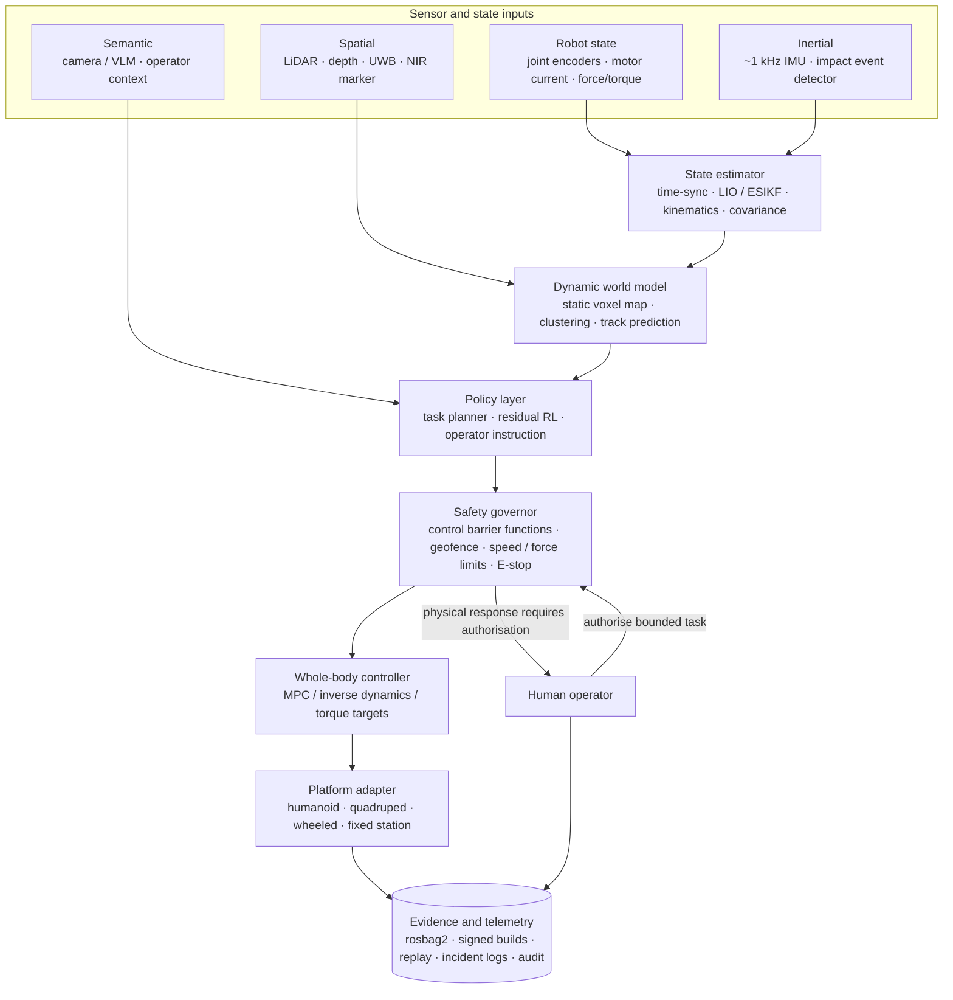
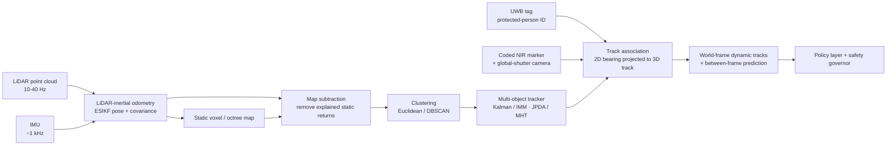
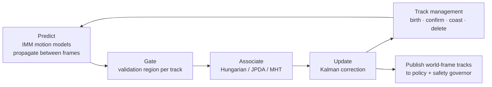
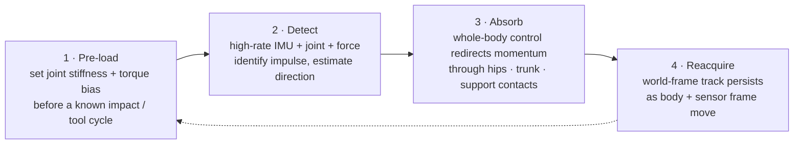
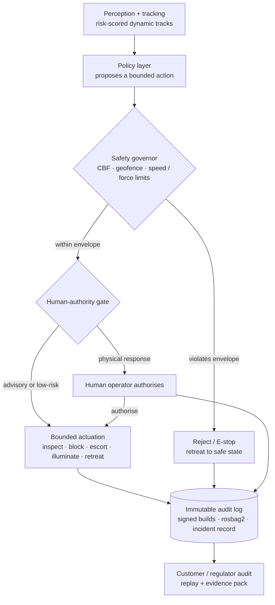

# A Software-First Spatial-Intelligence Layer for Contact-Capable Robots: Perception, Dynamic Tracking, Impact Recovery, and Governance-by-Design

**Christopher I. V. Farmer, LL.M. (University of Worcester) · Independent Researcher · civfarmer@gmail.com**

*Preprint — submitted; pending peer review. Phase II systems-architecture / theory paper. Version 1.0, July 2026.*

> **Scope and responsibility note.** This paper describes a *software and control-layer* architecture — a perception, tracking, contact-recovery and governance runtime intended to run on commercially available robot hardware. It does not describe, specify, or endorse any weapon, munition, or autonomous use of force against persons. Throughout, physical response is treated as *human-authorised, bounded, and non-kinetic* (inspect, escort, interpose, block a path, illuminate, alarm, retreat, and summon a human team). The reference demonstrator, sensor cadences, and latency figures are engineering *targets* and vendor-published capabilities, clearly labelled as such; **no measured benchmark, telemetry value, or performance result is claimed anywhere in this paper.** Any figure presented is an illustration of method, not evidence of outcome. Governance — meaningful human authority, auditability, standards conformance, and export/dual-use control — is treated as a first-class layer of the product, not a disclaimer appended to it.

---

## Abstract

Robot hardware is commoditising. Humanoid, quadruped, and wheeled platforms with usable software-development kits are falling in price and rising in availability, and the associated actuator, battery, and LiDAR supply chains are maturing in parallel. As that happens, the scarce and defensible layer migrates upward, from the machine to the intelligence that makes the machine dependable — specifically, *spatial intelligence* that remains stable during contact, shock, and rapid motion. This paper sets out, at a systems level, a software-first spatial-intelligence layer for contact-capable robots built from four coupled components: (1) a hardware-abstraction and sensor-fusion runtime that separates a deterministic high-rate *reflex* lane from a slower *spatial* lane and an advisory *semantic* lane, correcting the common error of placing a vision-language model inside an inner balance loop; (2) a perception stack combining LiDAR-inertial odometry and localisation, a static-map-subtraction dynamic world model, and dynamic multi-object tracking that predicts target motion between LiDAR frames rather than waiting passively; (3) a contact-prediction and impact-recovery primitive — pre-load, detect, absorb, reacquire — that keeps a world-frame track alive while the body and sensor frame are displaced; and (4) a platform-adapter architecture that reuses one core across robot sport, industrial autonomy, critical-infrastructure security, and, later and only under regulation, human-governed protective robotics. The paper gives particular weight to *governance by design*: meaningful human authority and oversight, immutable auditability and logging, functional-safety and standards conformance, and export/dual-use screening built into the control layer rather than bolted onto it. The contribution is architectural and integrative, not empirical; the defensible asset is the test corpus, safety evidence, and cross-platform abstraction, not any single robot.

**Keywords:** robot perception; LiDAR-inertial odometry; simultaneous localisation and mapping; sensor fusion; multi-object tracking; data association; whole-body control; impact recovery; control barrier functions; sim-to-real; human-in-the-loop autonomy; meaningful human control; functional safety; ISO 10218; ISO/TS 15066; responsible AI governance; auditability; dual-use export control.

---

## 1. Introduction

### 1.1 An inversion of scarcity

For most of the history of robotics the hard, expensive, differentiating thing was the machine. Actuators, power electronics, structural design, and the integration of the two were where value concentrated, and software was the thin layer that animated a costly and bespoke body. That relationship is inverting. General-purpose legged and mobile platforms with documented secondary-development interfaces are now sold at price points an order of magnitude below where comparable capability sat only a few years ago; humanoid platforms in particular are the subject of large and widely cited market projections into the 2030s (Goldman Sachs, 2024), and the International Federation of Robotics reports that a rising share of new service-robot ventures compete on software rather than on mechatronics (IFR, 2025). When the body becomes a purchasable commodity, the scarce layer moves upward.

The claim of this paper is specific about *which* upward layer is scarce. It is not general-purpose visual understanding — foundation models for images and language are advancing on their own trajectory and are not the bottleneck for a robot that must keep its balance. The scarce layer is *dependable spatial intelligence*: the ability to build and maintain an accurate, timely model of where the robot is, where everything around it is, how those things are moving, and how to remain stable and continue tracking through physical contact and shock. Spatial intelligence is scarce precisely because it is where the easy abstractions break. A perception stack that performs well on a smoothly moving survey robot can fail on a machine that is struck, that strikes, that stumbles and recovers, or that must keep a designated target in frame while its own sensor frame is violently displaced.

### 1.2 What "contact-capable" changes

A *contact-capable* robot is one whose intended function includes deliberate or unavoidable physical interaction with the world at non-trivial energy: an industrial arm that rivets, drills, or demolishes; a humanoid that must recover from a shove or a collision; a mobile platform that interposes itself, under human authority, between a hazard and a person it is escorting. Contact changes three things at once. First, it injects large, fast disturbances into the state estimate exactly when that estimate matters most. Second, it couples the slow, semantically rich perception layer to the fast, safety-critical control layer, and the naive coupling of the two — running everything at the pace of the slowest sensor — is the true latency problem, not the raw refresh rate of any single device. Third, it raises the stakes of every design choice from a question of performance to a question of safety and, ultimately, of law: a machine that can exert force near people is a *safety component* in the regulatory sense, and its software is part of that safety case.

### 1.3 Contributions and structure

This paper's contribution is architectural and integrative rather than empirical. It does not report an experiment; it specifies, at a systems level, how the established building blocks of robot perception and control should be *assembled and governed* to make contact-capable autonomy dependable and deployable across several markets from one reusable core. Concretely, it offers: a three-lane latency architecture that separates reflex, spatial, and semantic processing (Section 3); a perception stack integrating LiDAR-inertial odometry, a dynamic world model, and between-frame predictive multi-object tracking, with a compliant operator-designation module in place of unsafe alternatives (Section 4); a contact-prediction and impact-recovery primitive built on whole-body control (Section 5); a platform-adapter architecture spanning robot sport, industrial autonomy, infrastructure security, and later human-governed protective robotics (Section 6); and — given deliberate weight — a governance-by-design layer covering human authority, auditability, functional-safety conformance, and dual-use export control (Section 7). Section 8 describes a labelled reference implementation and a validation approach that fabricates no benchmarks; Section 9 states limitations; Section 10 concludes.

### 1.4 A responsible-robotics stance, stated first

Because the perception and control capabilities discussed here are dual-use, the paper's normative stance is stated at the outset rather than left to a closing caveat. The architecture is designed so that any physical response is *bounded* (limited in force, speed, and contact by a safety governor), *human-authorised* (a person, not the system, decides on physical intervention), and *non-weaponised* (the enumerated behaviours are inspection, escort, interposition, path-blocking, illumination, alarm, and retreat). This is not a rhetorical gesture. As Sections 5 through 7 develop in detail, the same design decisions that make the system safe — a narrow deterministic reflex lane, an advisory-only semantic lane, a hard safety governor, an immutable audit trail, and export classification by function — are also what make it defensible commercially and legally. Responsibility and product quality are, here, the same engineering problem.

---

## 2. The Scarcity Thesis: Spatial Intelligence as the Value Layer

### 2.1 Falling hardware cost, rising software premium

The investment logic of a software-first spatial layer rests on a factual premise and an inference. The premise is that the physical substrate of contact-capable robotics is becoming cheaper and more widely available: base humanoids with development editions, quadrupeds with mature SDKs, industrial arms, and the LiDAR, IMU, and compute components that instrument them are all subject to competitive supply and, in the mass-produced cases, to learning-curve cost decline. The inference is that as the body commoditises, buyers stop paying a premium for it and start paying a premium for whatever remains scarce and hard to replicate. History across computing hardware, smartphones, and automotive electronics is consistent: margin migrates from the commoditised layer to the layer that is still difficult.

The difficult layer, for contact-capable robots, is dependable spatial intelligence. This is defensible because it is *earned*, not bought: it is the accumulated result of test data across many contact events, tuned perception and control modules, a demonstrated safety record, and a cross-platform abstraction that lets the same competence run on different bodies. None of that transfers with a purchase order. A competitor can buy the identical humanoid and the identical LiDAR the next morning; it cannot buy the corpus of impact-recovery episodes, the calibrated fusion pipeline, or the safety evidence pack.

### 2.2 What to build, and what deliberately not to build

A software-first strategy is disciplined as much by what it declines to build as by what it builds. Table 1 states the division.

**Table 1 — Build versus deliberately-not-build for a software-first spatial layer.**

| Build (the scarce layer) | Deliberately do not build |
|---|---|
| Hardware-abstraction and sensor-fusion runtime | Actuators, batteries, motors, structural robot bodies |
| Deterministic high-rate reflex lane (balance, impact, recovery) | LiDAR, IMU, camera, or UWB hardware |
| Spatial lane: dynamic-object isolation and between-frame prediction | A general-purpose visual foundation model |
| Application modules (industrial contact, security, protection, sport) | A manufacturing plant ahead of product-market fit |
| Safety governor, evidence pack, and deployment audit trail | Bespoke robots when a reference platform will serve |

The right posture is *reference hardware, not a robot factory*. The company integrates against a small number of well-documented reference platforms and treats each as replaceable behind a platform-adapter interface (Section 6). This keeps capital expenditure low, avoids competing with the OEMs who make the bodies, and positions the software as the layer those OEMs would rather license than rebuild. It also keeps the engineering focused on the scarce competence instead of dissipating it across a supply chain the company does not need to own.

### 2.3 Why not simply scale a visual foundation model

A tempting alternative is to treat the problem as one more application of a large multimodal model: give a general vision-language system enough context and let it drive. This is the wrong tool for the load-bearing part of the problem, and Section 3 explains why in timing terms. In brief: the inner loops that keep a contact-capable robot upright and safe operate at hundreds to a thousand hertz with hard deadlines, and semantic models — however capable — are asynchronous, high-latency, and non-deterministic. A dependable spatial layer is not a bigger model; it is a *correctly stratified system* in which fast deterministic estimation and control are protected from slow probabilistic cognition, and in which the semantic layer informs but does not command high-force motion.

---

## 3. The Latency Problem and a Three-Lane Architecture

### 3.1 The real bottleneck is coupling, not refresh rate

A recurring misconception is that dependable reflexes require every sensor to run at kilohertz rates. Serious robots do not, and cannot, put a vision-language model in the inner balance loop; the practical bottleneck is not the speed of any single sensor but the *coupling* of slow semantic perception, asynchronous sensors, and whole-body control — especially under impact, when the disturbance arrives faster than the slow layers can react. The architectural answer is to stop pretending the sensors are homogeneous and instead to stratify processing by the cadence each modality can honestly sustain.

**Table 2 — Credible prototype cadences by layer (vendor-capability and engineering targets; not measured system results).**

| Layer | Credible cadence | Role |
|---|---|---|
| IMU / joint state | 500–1,000 Hz | shock detection, posture and state update |
| Whole-body control | 100–500 Hz | torque targets, balance and recovery |
| LiDAR refresh | 10–40 Hz | world geometry and dynamic-object updates |
| Optical-marker camera | 60–115 fps | operator-designated track confirmation |
| Semantic vision / VLM | asynchronous | context, classification, reporting |

The cadences in Table 2 are drawn from published sensor capabilities (for example, 1 kHz-class inertial units, 10–40 Hz spatial LiDAR, and global-shutter near-infrared cameras in the 60–115 fps range). They are presented as design targets, not as achieved measurements.

### 3.2 Three lanes

From Table 2, the architecture separates three lanes with different determinism guarantees, different rates, and — critically — different *authority* over motion.

- **Reflex lane.** Deterministic, high-rate, and deliberately narrow. It consumes IMU, joint-state, and force/torque signals to detect impacts and drive balance and recovery. Its authority is to protect the machine and its surroundings on a hard deadline; its scope is intentionally small so that it can be made deterministic and verifiable. An honest engineering target here is sub-5-millisecond processing for *selected inertial reflex operations* and a low-single-digit-millisecond state-to-command budget — but only for the narrow reflex computation, never as an end-to-end perception claim.

- **Spatial lane.** Consumes LiDAR, depth, UWB, and the near-infrared marker to maintain the world model and the dynamic-object tracks. Because its native rate is 10–40 Hz, it must *predict* motion between frames rather than wait passively for the next scan; the tracker (Section 4.4) carries a motion model precisely so that the 25–100-millisecond gap between LiDAR frames does not translate into blind time.

- **Semantic lane.** Advisory context, classification, and reporting from cameras and, optionally, a vision-language model. It runs asynchronously and, by rule, *does not directly command high-force motion*. It can raise a flag, propose a classification, or annotate a track for a human; it cannot instruct the reflex or whole-body layers to exert force.

### 3.3 An honesty principle about latency claims

A software-first spatial layer must be scrupulous about what it claims. It is legitimate to target sub-5-millisecond processing for a narrow inertial reflex operation, because that computation genuinely can be made small and deterministic. It is not legitimate to claim sub-5-millisecond *end-to-end perception* from a 10–40 Hz LiDAR, because the physics of the sensor forbid it: a new spatial frame simply is not available more often than every 25–100 milliseconds. The three-lane split is what lets both statements be true simultaneously — fast reflexes and honest spatial latency — and stating the distinction plainly is itself part of the governance posture, because inflated latency claims are how safety cases quietly become fiction.

### 3.4 The control core

Figure 1 gives the layered control core. Inputs are stratified into robot state, inertial, spatial, and semantic groups; a state estimator fuses them into a time-synchronised estimate; a dynamic world model maintains the static map and the moving-object tracks; a policy layer proposes tasks; a *safety governor* filters every proposed action against hard limits and the human-authority gate; a whole-body controller renders authorised actions into torque targets; a platform adapter maps those to a specific embodiment; and an evidence-and-telemetry layer records everything for replay and audit.

**Figure 1 — System architecture: one control core, replaceable sensors, embodiments, and applications. Illustrative schematic.**



This core is the reusable asset. Everything above the platform adapter is embodiment-neutral; everything the adapter touches is replaceable. Sections 4 and 5 detail the two most demanding blocks — the dynamic world model with its tracker, and the impact-recovery primitive inside the whole-body controller — and Section 7 details the safety governor and the evidence layer, which are where governance lives in the runtime.

---

## 4. The Perception Stack

### 4.1 Hardware abstraction, time synchronisation, and fusion

The runtime's lowest layer is a hardware-abstraction and sensor-fusion substrate whose first job is unglamorous but decisive: to bring heterogeneous, asynchronous sensors into a common time base. Fusion of inertial, LiDAR, and camera data is only as good as the timestamps that align them; on a contact-capable robot, a few milliseconds of clock skew between the IMU and the LiDAR becomes a geometric error precisely during the fast motion that matters. The substrate therefore uses hardware timestamps and a precision time protocol where the hardware supports it, exposes each sensor behind a uniform interface so that a Livox-class or an Ouster-class LiDAR can be swapped without touching downstream code, and publishes state with explicit covariance so that consumers know not just the estimate but its uncertainty. Modern robot middleware — a data-distribution-service transport under a real-time-patched kernel — provides the bounded-latency messaging this requires and has been shown to underpin reliable deployments across land, air, sea, and space domains (Macenski et al., 2022).

### 4.2 LiDAR-inertial odometry and localisation

Localisation is the foundation of spatial intelligence: everything else is expressed relative to where the robot believes it is. The problem is the classic one of simultaneous localisation and mapping (SLAM), whose modern formulation, open problems, and maturity are surveyed by Cadena et al. (2016) and, in tutorial form, by Durrant-Whyte and Bailey (2006). For a contact-capable robot the estimator of choice is a tightly coupled *LiDAR-inertial odometry* (LIO), which fuses the high-rate IMU with the geometric constraint of the LiDAR so that the inertial signal carries the estimate through the gaps and the fast rotations that would defeat LiDAR alone. The lineage runs from feature-based LiDAR odometry and mapping (Zhang & Singh, 2014) through tightly coupled smoothing (Shan et al., 2020) to direct, filter-based methods that register raw points without feature extraction using an iterated error-state Kalman filter (Xu et al., 2022; the error-state formulation itself is set out by Solà, 2017). The error-state Kalman filter matters here because it maintains the covariance the fusion substrate needs to advertise, and because its iterated form is fast enough to run inside the spatial lane's budget.

A licensing caveat belongs in the engineering plan, not only in a legal appendix. Several of the most capable open LIO implementations are distributed under strong copyleft (GPL-2.0). They are entirely appropriate for research evaluation, but a commercial product should either isolate such components with proper architectural and licence separation, obtain specialist licensing advice, or implement a clean proprietary equivalent of the LIO/ESIKF concepts. Permissively licensed point-cloud and 3D-processing libraries (BSD- and MIT-licensed) can supply much of the surrounding machinery without that constraint. Treating open-source diligence as a design input rather than an afterthought is, again, part of governing the product rather than merely building it.

### 4.3 The static world model and dynamic-object isolation

With a pose estimate in hand, the world model separates the world into what stays put and what moves. A probabilistic volumetric map — an octree-based occupancy representation that explicitly encodes occupied, free, and unknown space and compresses aggressively (Hornung et al., 2013), or a voxel map maintained by the LIO front end — captures the static geometry. *Dynamic-object isolation* is then performed by subtracting the static map from the current scan: returns that the static map does not explain are candidate moving objects. These residual points are grouped into object hypotheses by spatial clustering — Euclidean clustering or density-based clustering such as DBSCAN — yielding, at each spatial-lane tick, a set of clustered detections with position and extent. The occupancy grid idea that underlies this separation traces to Elfes (1989); its value for a contact-capable robot is that it lets the tracker (Section 4.4) reason only about the handful of things that are actually moving, rather than about the whole point cloud.

### 4.4 Dynamic multi-object tracking with between-frame prediction

Detections are not tracks. Turning a sequence of per-frame clusters into stable, identity-preserving *tracks* — each with an estimated position, velocity, and uncertainty that persists across frames and survives momentary occlusion — is the province of multi-object tracking (MOT), a mature discipline whose algorithmic canon is compiled by Bar-Shalom, Willett, and Tian (2011). Three ideas from that canon are load-bearing here.

- **Recursive state estimation per track.** Each track carries a Kalman filter (Kalman, 1960) predicting its next state from a motion model and correcting it against the associated detection. Because a moving person or robot does not obey a single motion model — it walks, then turns, then accelerates — an *interacting multiple model* (IMM) estimator runs a bank of models (for example constant-velocity, constant-turn, and constant-acceleration) and blends them according to their running likelihood (Blom & Bar-Shalom, 1988), which is what keeps the estimate honest through manoeuvres.

- **Data association.** With several tracks and several detections per frame, the tracker must decide which detection updates which track. Classical solutions span global-nearest-neighbour assignment via the Hungarian algorithm, joint probabilistic data association (JPDA) for cluttered scenes, and multiple-hypothesis tracking (MHT), which defers hard association decisions by carrying competing hypotheses forward (Reid, 1979). A pragmatic modern baseline for the 3D LiDAR case combines a 3D Kalman filter with Hungarian assignment and runs comfortably in real time (Weng et al., 2020); the two-dimensional analogue that pairs a Kalman filter with simple association (Bewley et al., 2016) is a useful reference point for the camera-only case.

- **Prediction between LiDAR frames.** This is where the spatial lane earns its keep. Because LiDAR delivers geometry only every 25–100 milliseconds, the tracker's motion model is used to *propagate* each track forward between scans, so that the policy and safety layers always have a current best estimate of where each moving object is *now*, not where it was at the last frame. Predicting rather than waiting is the difference between a robot that reacts to stale geometry and one that anticipates.

The tracker publishes *world-frame* tracks — expressed in the fixed world frame rather than the moving sensor frame — which is what allows a track to persist while the robot's own body is displaced (Section 5.4). Figure 2 shows the perception pipeline; Figure 3 shows the tracking loop.

**Figure 2 — Perception pipeline from raw sensors to world-frame dynamic tracks. Illustrative schematic.**



**Figure 3 — The tracking loop: a recursive predict–gate–associate–update–manage cycle. Illustrative schematic.**



### 4.5 Operator-designated tracking without unsafe optics

A contact-capable protective or inspection robot often needs a human to *designate* which object matters — this person to escort, that panel to inspect. A superficially attractive way to do this is a near-infrared "invisible" pointer, but it is both unsafe and legally self-defeating, and the architecture explicitly rejects it. An 850-nanometre beam is not safe merely because it is invisible; the absence of a blink reflex can make near-infrared exposure *more* hazardous than visible light, and mounting any such pointer on a weapon would create immediate safety, liability, and export-control problems.

The compliant alternative preserves the useful sensor-fusion idea and discards the hazard. A trained operator places a *coded, Class-1 (eye-safe) near-infrared LED beacon or a passive retroreflective marker*. A global-shutter near-infrared camera detects the code and estimates its two-dimensional bearing; a calibration projects that bearing into the LiDAR world model and associates it with a three-dimensional track (Section 4.4); and the robot then follows an *approved, bounded* task — inspect, approach, illuminate, block, or maintain standoff. Figure 4 shows the chain. Any coercive or armed use would require destination-specific export classification, a customer safety case, and explicit human authorisation; neutral file names and civilian mounts do not change that, and the architecture does not pretend otherwise.

**Figure 4 — Compliant operator-designation chain (replaces unsafe "invisible pointer" concepts). Illustrative schematic.**

```
 CODED NIR MARKER        NIR GLOBAL-SHUTTER        2D->3D CALIBRATION       TRACK ID           BOUNDED TASK
 (placed by trained  ->  CAMERA                ->  (project marker into ->  (associate with ->  inspect · approach ·
  operator; Class-1       (detect code,             LiDAR world model)       3D world track)     illuminate · block ·
  eye-safe)               estimate 2D bearing)                                                   maintain standoff)
```

---

## 5. Contact Prediction and Impact Recovery

### 5.1 Why contact breaks conventional stacks

The claim that spatial intelligence, not hardware, is the scarce layer is sharpest at the moment of contact. An impact is a large, fast disturbance that simultaneously (a) corrupts the state estimate through violent sensor motion, (b) threatens balance, and (c) displaces the sensor frame so that a target being tracked can leave the field of view. A perception-and-control stack tuned for smooth motion tends to fail on all three at once: the estimate diverges, the controller reacts too late, and the track is lost. A contact-capable system must instead treat impact as a *first-class, anticipated event* with its own dedicated primitive.

### 5.2 The impulse-recovery primitive

The core primitive is a four-phase cycle — pre-load, detect, absorb, reacquire — that spans the reflex and spatial lanes and is the single most reusable piece of the value proposition, because the same primitive serves robot sport and high-impact industrial work alike.

1. **Pre-load.** Where an impact or a tool cycle is *known in advance* — a rivet stroke, a drilling engagement, a scripted arena exchange — the controller adjusts joint stiffness and torque bias *before* the event, so the machine meets the impulse already braced rather than reacting after the fact.
2. **Detect.** When the impulse arrives, high-rate IMU, joint, and force/torque signals in the reflex lane identify it and estimate its direction within the reflex lane's low-single-digit-millisecond budget.
3. **Absorb.** The whole-body controller redirects the incoming momentum through the hips, trunk, and support contacts, rather than resisting it rigidly at a single joint — the difference between a system that dissipates a blow and one that is toppled by it.
4. **Reacquire.** Throughout, the *world-frame* target track (Section 4.4) is maintained so that, once the body and sensor frame have moved, the system re-associates the target from its predicted world position rather than searching blindly.

**Figure 5 — The Dynamic Impulse Recovery cycle. Illustrative schematic.**



### 5.3 The whole-body control substrate

The absorb and pre-load phases rest on a whole-body controller that reasons about the full multi-body dynamics rather than about isolated joints. The established substrate is optimisation-based: model-predictive control that plans ground-reaction forces or joint torques over a short horizon, solved fast enough to run in the control lane. Convex formulations for legged systems solve such problems to optimality in around a millisecond at tens of hertz (Di Carlo et al., 2018), and optimisation-based estimation and whole-body control have been demonstrated on full humanoids (Kuindersma et al., 2016). Onto this deterministic substrate the system layers *residual reinforcement learning* — a learned policy that outputs a bounded *correction* to the model-based controller rather than replacing it (Johannink et al., 2019). The residual is deliberately confined to a bounded action envelope so that learning improves behaviour within limits the safety governor still enforces; the learned component can help, but it cannot exceed the envelope that the model-based controller and the governor define. This is a governance decision as much as a performance one: it keeps the verifiable core in charge and the learned part on a leash.

### 5.4 Track persistence through shock

The reacquire phase deserves emphasis because it is where perception and control meet. By expressing tracks in the world frame and propagating them with the tracker's motion model, the system decouples *what the target is doing* from *what the robot's body is doing*. When an impact throws the sensor frame, the target's world-frame track continues to be predicted forward; when the sensors stabilise, the system re-associates incoming detections with the predicted track rather than initialising a new one. The competence being sold is precisely this: keeping the world model coherent while the machine that hosts it is being knocked around.

### 5.5 Proof metrics — to be benchmarked, not claimed

A credible programme states *how it would be measured* without pretending it has already been measured. Table 3 lists the metrics by which an impulse-recovery capability should be benchmarked against the platform's stock controller. Every entry is a *proposed measurement*, to be established against a baseline under controlled conditions; **no value for any of them is claimed in this paper.**

**Table 3 — Proposed impact-recovery proof metrics (to be benchmarked against the stock controller; no figures claimed).**

| Metric | What it captures |
|---|---|
| Peak torso angular velocity vs. stock controller | severity of the disturbance the controller allows |
| Time to stable support state | how quickly the machine recovers |
| Fall rate across randomised impacts | robustness over a distribution of shocks |
| World-track error during and after shock | whether the target track survives the impact |
| Thermal and actuator-limit compliance | whether recovery stays within safe operating limits |

The industrial framing here is substantive, not cosmetic: demolition, riveting, drilling, rescue, and heavy manipulation genuinely require shock stability, and the same primitive that keeps a humanoid upright after a collision keeps an industrial arm's tool on target through a stroke. Regulatory classification, however, follows technical function and end use, not the market label attached to a capability — a point Section 7 takes up.

---

## 6. The Platform-Adapter Architecture Across Markets

### 6.1 One core, many bodies

The commercial reach of a software-first layer comes from reusing a single core across embodiments and applications without multiplying the core engineering team. The mechanism is the *platform adapter* of Figure 1: a thin, embodiment-specific layer that maps the core's abstract commands (torque targets, task goals) onto a particular robot's interfaces, and maps that robot's sensors back into the core's abstractions. Above the adapter, the estimator, world model, tracker, impulse-recovery primitive, safety governor, and evidence layer are shared. Below it, the humanoid, quadruped, wheeled, fixed, or arm embodiment is replaceable. Application *modules* — thin configurations of the shared core for a particular job — sit alongside the adapter.

### 6.2 Four wedges and a later, regulated fifth

The architecture is brought to market through a sequence of wedges chosen so that early revenue comes where buying cycles are short and evidence is valued, and sensitive markets are entered only after governance has caught up.

- **Robot sport (the proving ground).** Robot-on-robot contact in a closed, instrumented arena is an ideal *validation environment*, not the core market. High-energy contacts generate exactly the balance and durability data the impulse-recovery primitive needs; rules and arenas constrain the environment; and visible outcomes make benchmarks legible to customers and investors. It is a real but small commercial wedge, and it should be treated as a source of engineering evidence rather than mistaken for the total addressable market.

- **Industrial contact and autonomy.** Demolition, riveting, drilling, maintenance, rescue, and heavy manipulation require the shock stability the primitive provides; inspection autonomy on quadrupeds requires the world model and tracking. This is where the impulse-recovery competence has its largest, least speculative demand.

- **Critical-infrastructure security.** Perimeter tracking on quadrupeds, fixed sentry and pan-tilt intrusion tracking, and inspection escort turn the perception stack toward detection, three-dimensional intrusion tracks, and alarm — with, always, *human-authorised* and non-kinetic responses.

- **Protective robotics — later, and only under regulation.** Personal-protection applications (the "Guardian" pattern of Section 6.3) are commercially compelling only if the first product is *visibly safe and human-governed*, and are deferred until the safety and governance case supports them.

### 6.3 The Guardian pattern: human-governed protection

The protective pattern illustrates the responsible-robotics stance concretely. A wearable ultra-wideband (UWB) tag establishes the protected person's track; published module accuracy is on the order of sub-15-centimetre two-dimensional and sub-30-centimetre three-dimensional under suitable conditions, which is useful but is *not* guaranteed centimetre-perfect positioning, and the system is designed around that honest envelope rather than an idealised one. The *permitted first behaviours* are strictly bounded and non-kinetic: escort, interpose, block a path, illuminate or alarm, retreat to safety, and summon a human response team. The control principle is that an approaching cluster is *risk-scored* from its speed, trajectory, and proximity, and that human-defined policy limits the force, speed, and contact the machine may use. Validation begins with adult staff, mannequins, and soft targets behind safety cages — never with the vulnerable people such a system might one day protect. The commercial route is through licensed security integrators who own the site, the staffing, the communications, and the local regulatory relationship; the software supplier remains the *motion-intelligence and safety layer*, not the operator.

### 6.4 Device diversification

Table 4 shows how one core spreads across embodiments. The point is not that the company builds all of these at once — aerial systems in particular are explicitly *not* an initial build — but that each is a configuration of the same shared competence.

**Table 4 — Platform-adapter matrix: one core, replaceable embodiments and application modules.**

| Embodiment | Representative modules | Illustrative buyers |
|---|---|---|
| Humanoid | impulse recovery · body shielding · dynamic interception · whole-body-control adapter | OEMs · research labs · competition teams · industrial integrators |
| Quadruped | perimeter tracking · inspection escort · impact stability · stair/terrain world model | energy · chemicals · mining · utilities · emergency response |
| Wheeled robot | Guardian pattern · patrol · access-zone enforcement · dynamic site map | campuses · hospitals · logistics · security providers |
| Fixed sentry / pan-tilt | 3D intrusion tracks · operator designation · alarm and illumination · drone cueing | ports · substations · warehouses · critical infrastructure |
| Industrial arm / tool | pre-tension · shock rejection · vibration recovery · target-frame persistence | demolition · riveting · drilling · maintenance OEMs |
| Aerial (future; not an initial build) | world-model service · track handoff · base-station fusion | inspection and facility-security integrators |

### 6.5 The moat

It follows that the defensible asset is not a single robot of any kind. It is the *test corpus* of contact and tracking episodes, the *safety evidence* accumulated across deployments, the *cross-platform abstraction* that lets competence move between bodies, and the *tuned control and perception modules* that make contact-capable autonomy deployable. Those four things compound with use and do not transfer with a hardware purchase, which is exactly what makes a software-first strategy defensible where a hardware-first one would not be.

---

## 7. Governance by Design

Governance is treated here as a *layer of the product*, engineered into the runtime, rather than as a policy wrapped around it. Four sub-layers make it concrete: meaningful human authority and oversight; auditability and logging; functional-safety and standards conformance; and export/dual-use screening. A fifth subsection states the non-weaponisation boundary that constrains all of them.

### 7.1 Meaningful human authority and oversight

The design principle is that a human, not the system, holds authority over physical intervention, and that this authority is *meaningful* rather than nominal. The human-factors literature has long distinguished *levels and types of automation* — automation can assist with information acquisition, information analysis, decision selection, and action implementation, each at a level from fully manual to fully automatic (Parasuraman, Sheridan, & Wickens, 2000) — and the tradition of human *supervisory* control (Sheridan, 1992) frames the operator as the supervisor of an automated process rather than its passive monitor. The philosophical account of *meaningful human control* sharpens this into two design conditions (Santoni de Sio & van den Hoven, 2018): a *tracking* condition, that the system responds to the reasons and intentions of the humans who design and deploy it and to the relevant facts of its environment; and a *tracing* condition, that every outcome be traceable back to at least one human in the design–deployment–operation chain. These are not abstractions; they map directly onto the architecture.

- **The semantic lane is advisory only.** By construction (Section 3.2), the slow cognitive layer can inform, classify, and flag, but cannot command high-force motion. This is a tracking-condition guarantee written into the dataflow.
- **The safety governor is a hard filter.** Every action the policy layer proposes passes through a safety governor that enforces *control barrier functions* — a formal method for guaranteeing that a system's state stays within a safe set by filtering any commanded action that would leave it (Ames et al., 2017; Ames et al., 2019) — together with geofences, speed and force limits, and an independent emergency stop. The governor cannot be talked past by the policy layer or the semantic lane; it is the last deterministic gate before actuation.
- **Physical response requires explicit human authorisation.** For any bounded physical intervention, the governor routes an authorisation request to a human, whose decision is the proximate cause of the action and is recorded as such — the tracing condition, instrumented. This addresses directly the *responsibility gap* that arises when a learning system acts in ways its operators did not specify (Matthias, 2004): the architecture is arranged so that no high-force action occurs without a human in the causal chain who authorised it.

Figure 6 shows the authority flow. Note that the human-authority gate and the audit log are not optional add-ons; they are on the critical path from perception to actuation.

**Figure 6 — Governance and human-authority flow. Every physical response passes a hard safety filter and a human-authority gate, and everything is logged immutably. Illustrative schematic.**



### 7.2 Auditability and logging

A system that can exert force near people must be able to *show what it did and why*. The runtime therefore records a tamper-evident evidence trail: full sensor-and-command bags for deterministic replay (rosbag2-style recording), cryptographically signed builds so that the exact software version in the field is provable, a model registry pinning which learned policy was active, and structured incident logs. This is the engineering realisation of the "ethical black box" argued for by Winfield and Jirotka (2017) — a flight-recorder analogue for robots, without which accident investigation is guesswork — and it aligns with the emerging IEEE standard on transparency of autonomous systems (IEEE, 2021), which frames the ability to explain and reconstruct a system's behaviour as a design requirement. The audit trail serves three constituencies at once: engineers replaying a failure, customers demonstrating due diligence, and regulators or investigators reconstructing an incident. Because the log is on the critical path (Figure 6), auditability is not something the system *can* do; it is something it *cannot avoid* doing.

### 7.3 Functional safety and standards conformance

A contact-capable robot is a safety component, and its control software is inside the safety case. The conformance target is therefore a stack of established standards rather than a single certificate. Table 5 maps the relevant standards to the parts of the architecture they govern.

**Table 5 — Standards and governance mapping.**

| Standard / instrument | Governs | Relevance to this architecture |
|---|---|---|
| ISO 12100:2010 | Machinery safety — general principles, risk assessment | the top-level risk-assessment method for the whole system |
| ISO 10218-1:2025 | Robotics — safety requirements for industrial robots | the 2025 revision folds in collaborative requirements and adds functional-safety and cybersecurity clauses |
| ISO/TS 15066:2016 | Collaborative robots — power and force limiting | body-region force/pressure limits informing the governor's contact limits |
| ISO 13482:2014 | Safety requirements for personal-care robots | the reference frame for human-proximate mobile/service robots |
| ISO 13849-1:2023 | Safety-related parts of control systems | performance-level requirements for the governor and E-stop |
| IEC 61508:2010 | Functional safety of E/E/PE systems | safety-integrity-level lifecycle for the safety-critical software |
| Regulation (EU) 2023/1230 | EU Machinery Regulation | first EU machinery regime to treat AI safety functions explicitly (applies from 2027) |
| Regulation (EU) 2024/1689 | EU AI Act | high-risk-system obligations where the AI is a safety component |
| NIST AI RMF 1.0 (2023) | AI risk management | Govern–Map–Measure–Manage functions organising the programme |
| ISO/IEC 42001:2023 | AI management system | organisational management system for responsible AI |

Three points about this stack are worth drawing out. First, the 2025 revision of ISO 10218-1 is significant for exactly this class of system: it consolidates the collaborative-operation content formerly carried in ISO/TS 15066, introduces a robot-classification scheme, and adds explicit functional-safety and cybersecurity requirements — so a contact-capable industrial robot's safety case now sits more squarely inside a single, updated standard. Second, the power-and-force-limiting values of ISO/TS 15066 (derived from body-region tolerance studies) give the safety governor concrete numbers for its contact limits, which is precisely the sort of externally validated constraint a governor should enforce rather than invent. Third, functional safety is a *lifecycle*, not a feature: IEC 61508's safety-integrity levels demand disciplined development, verification, and change control of the safety-critical software, which is why signed builds and a model registry (Section 7.2) are safety artefacts and not merely engineering conveniences. Above the machinery standards, the EU AI Act's high-risk obligations, the OECD's AI Principles (OECD, 2019, rev. 2024), and the NIST AI Risk Management Framework's Govern–Map–Measure–Manage structure (NIST, 2023) supply the organisational scaffolding, and an AI management system (ISO/IEC 42001:2023) institutionalises it.

### 7.4 Export and dual-use screening in the control layer

Perception, tracking, and autonomy technologies are dual-use, and export control is therefore a design constraint, not a shipping formality. The controlling principle is that *classification follows technical function, design intent, destination, end user, and end use* — not the name a developer gives a software node. A component called a "DynamicImpulseDampeningNode" is classified on what it does, not on what it is called; euphemistic file names, the absence of weapon mounts, or an "open-source adapter" label do not change an item's legal status, and a private-security intermediary is not a legal firewall. Table 6 lists the regimes a Swiss-anchored, internationally sourced programme must screen against.

**Table 6 — Dual-use export-control regimes to screen against.**

| Regime / authority | Scope relevant here |
|---|---|
| Wassenaar Arrangement | multilateral control list for conventional-arms-related and dual-use goods and technologies, including software and technology |
| Regulation (EU) 2021/821 | EU dual-use regulation implementing Wassenaar and the other regimes; controls export, transit, brokering, and technical assistance |
| Swiss SECO (Goods Control Act / Ordinance) | licenses dual-use and specific military goods, including *intangible* software and technology transfers |
| US EAR (15 CFR 730–774) | classification, de minimis, and re-export rules that follow US-origin components (e.g., certain compute) even in a non-US product |
| UK export controls (ECJU) | listed controls plus a military end-use "catch-all" reaching software, technology, and technical assistance |

The programme therefore builds, into the product and the company rather than into a legal appendix: independent export classification; sanctions and end-user screening; human-rights due diligence on customers and destinations; the human-authority and bounded-force guarantees of Section 7.1; the audit logs of Section 7.2; cyber-hardening and incident response; insurance; and a documented safety case. Screening is, where possible, *instrumented in the control layer* — for example, geofencing and feature-gating that can be bound to a destination-specific configuration and recorded in the audit trail — so that compliance is demonstrable from the same evidence pack that demonstrates safety.

### 7.5 The non-weaponisation boundary

Finally, the boundary that constrains everything above. The architecture's enumerated physical behaviours are inspection, approach, illumination, alarm, interposition, path-blocking, escort, retreat, and the summoning of a human team. It does *not* provide, and this paper does not describe, autonomous use of force against persons, weapon integration, or automated "neutralisation." Any coercive or armed application would fall outside this architecture and would require, at minimum, destination-specific classification, an independent customer safety case, and explicit human authorisation — and would remain subject to the export regimes of Table 6 regardless of framing. The reason to state this as an engineering boundary rather than a mission statement is that it is enforced by the same mechanisms that make the system safe and auditable: an advisory-only semantic lane, a hard safety governor, a human-authority gate on the critical path, and an immutable log. Governance by design means that the boundary is *in the runtime*, not only in the brochure.

---

## 8. Reference Implementation and Validation Approach

### 8.1 A labelled reference demonstrator

To make the architecture concrete without over-claiming, a *reference demonstrator* is specified as an illustration of feasibility, not a product. Its purpose is to generate evidence, and every component is a replaceable reference behind the platform adapter. Table 7 lists an illustrative configuration; the specific parts are examples of a class, not endorsements or the only viable choices.

**Table 7 — Illustrative reference-demonstrator configuration (an example of method; not a product specification).**

| Function | Illustrative reference component |
|---|---|
| Base platform | secondary-development humanoid with SDK access (e.g., a G1-class EDU unit) |
| Spatial sensor | compact spatial LiDAR (lean build) or higher-refresh/-resolution LiDAR |
| Reflex sensor | 1 kHz-class IMU (e.g., a CV7- or MTi-class unit) |
| Protected-person tag | UWB module (BLE retained only for discovery/presence) |
| Optical designation | coded Class-1 NIR LED / retroreflective marker + NIR global-shutter camera |
| On-robot compute | embedded GPU compute module |
| Training compute | workstation-class GPU (off-robot) |

### 8.2 Two demonstrations, one core

The demonstrator supports two scenarios that exercise the shared core from opposite ends: an **Arena** scenario (robot-on-robot soft contact, impact recovery, and track reacquisition), which stresses the reflex lane and the impulse-recovery primitive; and a **Guardian** scenario (escort, path-blocking, alarm, and retreat around a *tagged* person, using soft targets and safety cages), which stresses the spatial lane, the tracker, and the human-authority path. Both run under safety controls: force-limited targets, an independent emergency stop, safety cages, and measured baselines. Crucially, a proper first build is a *contained laboratory benchmark*, not a field deployment.

### 8.3 Software stack and simulation discipline

The learning and simulation pipeline follows established sim-to-real practice. Contact-rich policies are trained in a GPU-accelerated simulator (Makoviychuk et al., 2021) and cross-checked against an independent contact-dynamics engine (Todorov et al., 2012), with *domain randomisation* over mass, friction, latency, and sensor noise to bridge the reality gap (Tobin et al., 2017). Teleoperation demonstrations seed policies before any reinforcement-learning fine-tuning; reward functions are human-reviewed; and — as a governance rule — no machine-generated reward function is deployed to hardware without human review. The runtime is a real-time-patched Linux with a data-distribution-service transport under bounded quality-of-service (Macenski et al., 2022); inference is compiled and accelerated for the edge; and control barrier functions and watchdogs guard actuation. Permissively licensed perception libraries are preferred, and any strongly copyleft component is isolated, licensed, or reimplemented (Section 4.2).

### 8.4 What is explicitly out of scope near-term

An honest plan is explicit about what it is *not* delivering early: market-ready certification, autonomous force against people, weapon integration, and unrestricted outdoor operation are all out of scope for an initial feasibility build. Stating these exclusions is part of the governance posture, because a validation programme that quietly implies certification or field-readiness it has not earned is exactly the kind of over-claim that safety and export regimes exist to catch.

---

## 9. Limitations

**This is an architecture paper, not an evaluation.** Its central claims are about how to *assemble and govern* known components, and it deliberately reports no measured performance. Every latency figure, sensor cadence, and proof metric is a target or a proposed measurement, clearly labelled; the reference demonstrator is an illustration. Nothing here should be cited as an empirical result, and the burden of proof — benchmarking against a stock controller under controlled conditions — remains to be discharged in future work.

**The sim-to-real gap for contact is real and under-modelled.** Contact dynamics are the hardest thing to simulate faithfully; a policy that recovers gracefully in simulation can fail on hardware where friction, compliance, and timing differ. Domain randomisation and independent-engine cross-checks reduce but do not eliminate this risk, and the impulse-recovery primitive in particular must be validated physically before any claim about it is credible.

**Spatial latency and occlusion bound the tracker.** Between-frame prediction mitigates the 25–100-millisecond LiDAR gap but cannot conjure information the sensor did not capture; fast, erratic, or occluded targets will still challenge association, and a mis-association during shock can lose a track precisely when it matters. The UWB positioning that anchors the Guardian pattern has a known accuracy *envelope* (sub-15-centimetre-class two-dimensional under suitable conditions), not centimetre-perfect certainty, and the system is only as good as the honesty of that envelope.

**Governance reduces but does not remove risk.** A hard safety governor, a human-authority gate, and an immutable log make the system auditable and bound its behaviour, but they cannot make a dual-use technology non-dual-use, and they depend on the standards and legal regimes of Section 7 continuing to mature — several of which (the EU Machinery Regulation's AI provisions, the AI Act's high-risk regime) are new and still settling. Nor can instrumented screening substitute for organisational diligence: classification, end-user vetting, and human-rights assessment are human responsibilities that the runtime can *support* but not replace.

**The strategy's own success condition is unproven.** The thesis that spatial intelligence, not hardware, is the scarce and defensible layer is an argument, not a demonstrated fact; it depends on hardware continuing to commoditise and on OEMs continuing to prefer to license rather than rebuild the spatial layer. Both are plausible and consistent with current market signals, but neither is guaranteed, and a vertically integrated OEM that builds the layer internally is the clearest competitive risk.

---

## 10. Conclusion

As robot bodies commoditise, value migrates to the layer that stays hard: dependable spatial intelligence that remains coherent through contact, shock, and rapid motion. This paper has set out, at a systems level, how to build that layer software-first. The architecture stratifies processing into a deterministic reflex lane, a predictive spatial lane, and an advisory semantic lane, correcting the error of putting a slow cognitive model inside a fast balance loop. On that spine it composes a perception stack — LiDAR-inertial odometry, a static-map-subtraction world model, and between-frame predictive multi-object tracking — and a contact primitive, pre-load–detect–absorb–reacquire, that keeps a world-frame track alive while the machine is displaced. One reusable core spreads across robot sport, industrial autonomy, and infrastructure security through a platform adapter, with human-governed protective robotics deferred until the safety case supports it. The defensible asset is not any robot but the test corpus, the safety evidence, and the cross-platform abstraction that accumulate with use.

The paper's deliberate emphasis is that governance is part of the product. Meaningful human authority, an advisory-only semantic lane, a hard safety governor enforcing formally grounded barriers and force limits, an immutable "ethical black box" on the critical path, conformance to the functional-safety and robot-safety standards, and export/dual-use screening bound to the control layer are not constraints imposed on the engineering from outside — they *are* the engineering. The same decisions that make a contact-capable robot safe and auditable make it lawful to sell and hard to misuse, and they enforce the non-weaponisation boundary in the runtime rather than in the prospectus. A responsible spatial-intelligence layer is not a capable system with governance added; it is a system whose capability and its governance are the same design.

---

## References

Ames, A. D., Xu, X., Grizzle, J. W., & Tabuada, P. (2017). Control Barrier Function Based Quadratic Programs for Safety Critical Systems. *IEEE Transactions on Automatic Control, 62*(8), 3861–3876.

Ames, A. D., Coogan, S., Egerstedt, M., Notomista, G., Sreenath, K., & Tabuada, P. (2019). Control Barrier Functions: Theory and Applications. *2019 18th European Control Conference (ECC)*, 3420–3431.

Bar-Shalom, Y., Willett, P. K., & Tian, X. (2011). *Tracking and Data Fusion: A Handbook of Algorithms.* Storrs, CT: YBS Publishing.

Bewley, A., Ge, Z., Ott, L., Ramos, F., & Upcroft, B. (2016). Simple Online and Realtime Tracking. *2016 IEEE International Conference on Image Processing (ICIP)*, 3464–3468.

Blom, H. A. P., & Bar-Shalom, Y. (1988). The Interacting Multiple Model Algorithm for Systems with Markovian Switching Coefficients. *IEEE Transactions on Automatic Control, 33*(8), 780–783.

Cadena, C., Carlone, L., Carrillo, H., Latif, Y., Scaramuzza, D., Neira, J., Reid, I., & Leonard, J. J. (2016). Past, Present, and Future of Simultaneous Localization and Mapping: Toward the Robust-Perception Age. *IEEE Transactions on Robotics, 32*(6), 1309–1332.

Di Carlo, J., Wensing, P. M., Katz, B., Bledt, G., & Kim, S. (2018). Dynamic Locomotion in the MIT Cheetah 3 Through Convex Model-Predictive Control. *2018 IEEE/RSJ International Conference on Intelligent Robots and Systems (IROS)*, 1–9.

Durrant-Whyte, H., & Bailey, T. (2006). Simultaneous Localization and Mapping: Part I. *IEEE Robotics & Automation Magazine, 13*(2), 99–110.

Elfes, A. (1989). Using Occupancy Grids for Mobile Robot Perception and Navigation. *Computer, 22*(6), 46–57.

Goldman Sachs Research. (2024). *Humanoid Robots: The Global Market Could Reach $38 Billion by 2035.* New York: Goldman Sachs.

Hornung, A., Wurm, K. M., Bennewitz, M., Stachniss, C., & Burgard, W. (2013). OctoMap: An Efficient Probabilistic 3D Mapping Framework Based on Octrees. *Autonomous Robots, 34*(3), 189–206.

IEEE. (2021). *IEEE Std 7001-2021 — IEEE Standard for Transparency of Autonomous Systems.* Piscataway, NJ: IEEE.

International Federation of Robotics. (2025). *World Robotics 2025 — Industrial Robots and Service Robots.* Frankfurt: IFR Statistical Department.

International Electrotechnical Commission. (2010). *IEC 61508:2010 — Functional Safety of Electrical/Electronic/Programmable Electronic Safety-Related Systems.* Geneva: IEC.

International Organization for Standardization. (2010). *ISO 12100:2010 — Safety of Machinery — General Principles for Design — Risk Assessment and Risk Reduction.* Geneva: ISO.

International Organization for Standardization. (2014). *ISO 13482:2014 — Robots and Robotic Devices — Safety Requirements for Personal Care Robots.* Geneva: ISO.

International Organization for Standardization. (2016). *ISO/TS 15066:2016 — Robots and Robotic Devices — Collaborative Robots.* Geneva: ISO.

International Organization for Standardization. (2023). *ISO 13849-1:2023 — Safety of Machinery — Safety-Related Parts of Control Systems — Part 1: General Principles for Design.* Geneva: ISO.

International Organization for Standardization. (2025). *ISO 10218-1:2025 — Robotics — Safety Requirements — Part 1: Industrial Robots.* Geneva: ISO.

ISO/IEC. (2023). *ISO/IEC 42001:2023 — Information Technology — Artificial Intelligence — Management System.* Geneva: ISO/IEC.

Johannink, T., Bahl, S., Nair, A., Luo, J., Kumar, A., Loskyll, M., Ojea, J. A., Solowjow, E., & Levine, S. (2019). Residual Reinforcement Learning for Robot Control. *2019 IEEE International Conference on Robotics and Automation (ICRA)*, 6023–6029.

Kalman, R. E. (1960). A New Approach to Linear Filtering and Prediction Problems. *Journal of Basic Engineering, 82*(1), 35–45.

Kuindersma, S., Deits, R., Fallon, M., Valenzuela, A., Dai, H., Permenter, F., Koolen, T., Marion, P., & Tedrake, R. (2016). Optimization-Based Locomotion Planning, Estimation, and Control Design for the Atlas Humanoid Robot. *Autonomous Robots, 40*(3), 429–455.

Macenski, S., Foote, T., Gerkey, B., Lalancette, C., & Woodall, W. (2022). Robot Operating System 2: Design, Architecture, and Uses in the Wild. *Science Robotics, 7*(66), eabm6074.

Makoviychuk, V., Wawrzyniak, L., Guo, Y., Lu, M., Storey, K., Macklin, M., Hoeller, D., Rudin, N., Allshire, A., Handa, A., & State, G. (2021). Isaac Gym: High Performance GPU-Based Physics Simulation for Robot Learning. *arXiv:2108.10470.*

Matthias, A. (2004). The Responsibility Gap: Ascribing Responsibility for the Actions of Learning Automata. *Ethics and Information Technology, 6*(3), 175–183.

National Institute of Standards and Technology. (2023). *Artificial Intelligence Risk Management Framework (AI RMF 1.0)* (NIST AI 100-1). Gaithersburg, MD: U.S. Department of Commerce.

Organisation for Economic Co-operation and Development. (2019, rev. 2024). *Recommendation of the Council on Artificial Intelligence* (OECD/LEGAL/0449). Paris: OECD.

Parasuraman, R., Sheridan, T. B., & Wickens, C. D. (2000). A Model for Types and Levels of Human Interaction with Automation. *IEEE Transactions on Systems, Man, and Cybernetics — Part A: Systems and Humans, 30*(3), 286–297.

Regulation (EU) 2021/821 of the European Parliament and of the Council of 20 May 2021 setting up a Union regime for the control of exports, brokering, technical assistance, transit and transfer of dual-use items. *Official Journal of the European Union.*

Regulation (EU) 2023/1230 of the European Parliament and of the Council of 14 June 2023 on machinery (Machinery Regulation). *Official Journal of the European Union.*

Regulation (EU) 2024/1689 of the European Parliament and of the Council of 13 June 2024 laying down harmonised rules on artificial intelligence (Artificial Intelligence Act). *Official Journal of the European Union.*

Reid, D. B. (1979). An Algorithm for Tracking Multiple Targets. *IEEE Transactions on Automatic Control, 24*(6), 843–854.

Santoni de Sio, F., & van den Hoven, J. (2018). Meaningful Human Control over Autonomous Systems: A Philosophical Account. *Frontiers in Robotics and AI, 5*, 15.

Shan, T., Englot, B., Meyers, D., Wang, W., Ratti, C., & Rus, D. (2020). LIO-SAM: Tightly-Coupled Lidar Inertial Odometry via Smoothing and Mapping. *2020 IEEE/RSJ International Conference on Intelligent Robots and Systems (IROS)*, 5135–5142.

Sheridan, T. B. (1992). *Telerobotics, Automation, and Human Supervisory Control.* Cambridge, MA: MIT Press.

Solà, J. (2017). Quaternion Kinematics for the Error-State Kalman Filter. *arXiv:1711.02508.*

Tobin, J., Fong, R., Ray, A., Schneider, J., Zaremba, W., & Abbeel, P. (2017). Domain Randomization for Transferring Deep Neural Networks from Simulation to the Real World. *2017 IEEE/RSJ International Conference on Intelligent Robots and Systems (IROS)*, 23–30.

Todorov, E., Erez, T., & Tassa, Y. (2012). MuJoCo: A Physics Engine for Model-Based Control. *2012 IEEE/RSJ International Conference on Intelligent Robots and Systems (IROS)*, 5026–5033.

Wassenaar Arrangement. (1996, as amended). *The Wassenaar Arrangement on Export Controls for Conventional Arms and Dual-Use Goods and Technologies — Lists of Dual-Use Goods and Technologies and Munitions List.* Vienna: Wassenaar Arrangement Secretariat.

Weng, X., Wang, J., Held, D., & Kitani, K. (2020). 3D Multi-Object Tracking: A Baseline and New Evaluation Metrics. *2020 IEEE/RSJ International Conference on Intelligent Robots and Systems (IROS)*, 10359–10366.

Winfield, A. F. T., & Jirotka, M. (2017). The Case for an Ethical Black Box. In *Towards Autonomous Robotic Systems (TAROS 2017), Lecture Notes in Computer Science* (Vol. 10454, pp. 262–273). Cham: Springer.

Xu, W., Cai, Y., He, D., Lin, J., & Zhang, F. (2022). FAST-LIO2: Fast Direct LiDAR-Inertial Odometry. *IEEE Transactions on Robotics, 38*(4), 2053–2073.

Zhang, J., & Singh, S. (2014). LOAM: Lidar Odometry and Mapping in Real-Time. *Robotics: Science and Systems (RSS) X.*

---

*Preprint — submitted; pending peer review. This paper describes a software and control-layer architecture for responsible, human-governed, contact-capable robotics. It contains no weapon, munition, or autonomous-use-of-force content of any kind; all physical responses discussed are bounded, non-kinetic, and human-authorised. All latency figures, sensor cadences, and proof metrics are engineering targets or vendor-published capabilities, clearly labelled; no measured benchmark or performance result is claimed.*


---

## Further reading and points of disagreement (July 2026 addendum)

Two literatures ground the architecture more firmly than the original reference list made explicit, and one live disagreement should be stated. First, the governance-by-design commitments of §6 are not free-floating: they map onto the industrial functional-safety and collaborative-robot standards (IEC 61508; ISO 10218; ISO/TS 15066) and, at the regulatory layer, the European Union's AI Act — and the deterministic reflex lane exists precisely because certification against those instruments requires bounded, analysable behaviour. Second, the empirical basis for treating contact as a designed-for event rather than a failure is Haddadin's safe physical human–robot interaction programme, with the control-theoretic lineage running back to Hogan's impedance framework; the perception stack's components correspond to current published baselines (LiDAR-inertial odometry and mapping; volumetric world models; online multi-object tracking). The disagreement: the contemporary research mainstream favours end-to-end learned policies, which promise performance the modular architecture here deliberately forgoes. I hold the line for a certification reason, not a performance one — a learned monolith cannot presently be decomposed into the auditable, bounded functions the safety standards and the governance commitments of §6 require, and physical response in this architecture is human-authorised and non-kinetic by construction.

- International Electrotechnical Commission, IEC 61508, *Functional Safety of Electrical/Electronic/Programmable Electronic Safety-Related Systems* (2010).
- International Organization for Standardization, ISO 10218-1/-2, *Robotics — Safety requirements* ; and ISO/TS 15066, *Robots and robotic devices — Collaborative robots* (2016).
- European Union, Regulation (EU) 2024/1689 (Artificial Intelligence Act), OJ L, 12 July 2024.
- Haddadin, S., Albu-Schäffer, A. & Hirzinger, G., "Requirements for safe robots: measurements, analysis and new insights" (2009) 28 *International Journal of Robotics Research* 1507–1527. https://doi.org/10.1177/0278364909343970.
- Hogan, N., "Impedance control: an approach to manipulation: Part I — theory" (1985) 107 *Journal of Dynamic Systems, Measurement, and Control* 1–7. https://doi.org/10.1115/1.3140702.
- Shan, T. et al., "LIO-SAM: tightly-coupled lidar inertial odometry via smoothing and mapping", *IEEE/RSJ IROS* (2020). https://doi.org/10.1109/IROS45743.2020.9341176.
- Xu, W. et al., "FAST-LIO2: fast direct LiDAR-inertial odometry" (2022) 38 *IEEE Transactions on Robotics* 2053–2073. https://doi.org/10.1109/TRO.2022.3141876.
- Hornung, A. et al., "OctoMap: an efficient probabilistic 3D mapping framework based on octrees" (2013) 34 *Autonomous Robots* 189–206. https://doi.org/10.1007/s10514-012-9321-0.
- Bewley, A. et al., "Simple online and realtime tracking", *IEEE ICIP* (2016). https://doi.org/10.1109/ICIP.2016.7533003.
